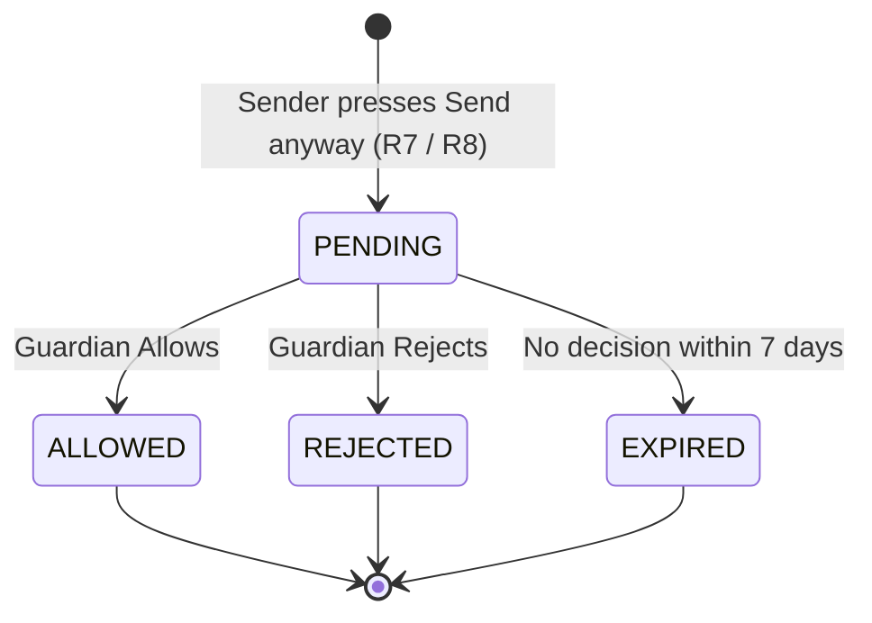

# Implementation Specification: DM Safety — Guardian Review by Age Zone

| | |
|---|---|
| **Source** | `2026-09-22_Family-Circle-DM-Safety-Workflow-by-Age-Zone_updatedHK.docx` (BA / Product Safety Spec, HK revision) |
| **Status** | Ready for build — Phase 1. Items in §14 need BA sign-off but have defaults so build is not blocked. |
| **Scope** | Direct messages (text) where the recipient is a minor (Kids, Teens, Mature Teens zone). |
| **Out of scope (Phase 2)** | Image / video / live moderation in DMs, follow-approval workflow, Kids-zone approved-contacts-only DMs, human review console, mandatory reporting integration. See §13. |

---

## 1. Summary of the change

Today, when a DM is flagged and the sender presses **Send anyway**, the recipient always receives a **masked** message and the guardian gets an acknowledge-only alert.

After this change:

1. A flagged **sexual** DM to a **monitored minor** is **held**, not delivered.
2. The sender is warned and may **Edit** or **Send anyway**. *Send anyway submits the message for guardian review* — it never delivers directly.
3. The recipient sees:
   - **Kids Zone / Teens Zone:** nothing.
   - **Mature Teens Zone:** a masked placeholder.
4. Every linked guardian gets a **high-priority Safety alert** with actions: **View** (light-masked), **Allow**, **Reject**, **Block sender**, **Report**, **Review DM settings**, **Message child**.
5. **Allow** delivers the original message. **Reject** (or 7 days with no decision) means it is never delivered.
6. Adult senders accumulate **strikes**: warning → 7-day ban on messaging minors → indefinite ban pending human review.
7. Every step is written to a **safety audit trail** and surfaced in the Family Circle **Activity** log.

---

## 2. Definitions

| Term | Definition |
|---|---|
| **Age zone** | Derived from `User.dateOfBirth` via `resolveAgeZoneFromDateOfBirth()` (`src/lib/utils/age-zone.ts`). Bands: `KIDS` < 13, `TEENS` 13–15, `MATURE_TEENS` 16–17, `ADULT` ≥ 18. |
| **Minor** | Zone is `KIDS`, `TEENS` or `MATURE_TEENS`. If DOB is missing and `accountType = MINOR`, treat as `KIDS` (most protective). |
| **Adult sender** | Sender zone is `ADULT`, or DOB is missing and `accountType` is `ADULT` or `GUARDIAN`. |
| **Monitored minor** | A minor with at least one `GuardianChildLink` row. |
| **Flagged** | `moderateDmText()` returns `allowed: false` with a real category (not `verificationFailed`). |
| **Sexual flag** | Flagged with category `Sexual`. |
| **Severity** | Azure severity on the 0–6 scale (`confidence × 6`). Current Sexual threshold is 2. Bands: **2 = low**, **4 = high**, **6 = severe**. The minor-solicitation lexicon match reports severity 4. |
| **Hold** | A `DmModerationHold` row: a flagged message awaiting guardian decision. |
| **Recipient treatment** | `WITHHELD` (recipient sees nothing) or `MASKED_PLACEHOLDER` (recipient sees a masked bubble). |
| **Strike** | A `SenderSafetyStrike` row recorded against a sender when a hold is created. |
| **High-risk cross-zone** | Sender is a minor, recipient is `KIDS`, and either the sender is `TEENS`/`MATURE_TEENS` or the age gap is ≥ 3 years. |

---

## 3. Policy decision matrix

Implement as a **pure function** `evaluateDmSafetyPolicy(input): DmSafetyDecision` in `src/lib/guardian/dm-safety-policy.ts`. No database access; fully unit-tested (§12).

### 3.1 Inputs

```ts
type DmSafetyPolicyInput = {
  flagged: boolean;
  verificationFailed: boolean;
  category: "Sexual" | "Hate" | "SelfHarm" | "Violence" | "Neutral";
  severity: 0 | 2 | 4 | 6;
  senderZone: AgeZoneCode;          // resolved per §2
  senderAgeYears: number | null;
  recipientZone: AgeZoneCode;
  recipientAgeYears: number | null;
  recipientMonitored: boolean;
  senderRestrictedFromMinors: boolean; // active UserDmRestriction (§8)
};
```

### 3.2 Outputs

```ts
type DmSafetyDecision = {
  outcome:
    | "deliver"                 // not flagged — normal send
    | "restricted"              // 403, sender banned from messaging minors
    | "warn"                    // 422, show warning (Edit / Send anyway)
    | "warn_no_override";       // 422, show warning (Edit only)
  onSendAnyway:
    | "hold_withheld"
    | "hold_masked_placeholder"
    | "masked_delivery"         // legacy behaviour, non-sexual categories
    | "not_allowed";
  alertPriority: "high" | "medium" | null;
  recordStrike: boolean;
  notifySenderGuardians: boolean;  // informational alert to a minor sender's guardians
  autoReport: boolean;             // system SafetyReport, urgent
};
```

### 3.3 Rules (evaluate top to bottom; first match wins)

| # | Condition | outcome | onSendAnyway | alertPriority | recordStrike | notifySenderGuardians | autoReport |
|---|---|---|---|---|---|---|---|
| R1 | Recipient is minor **and** `senderRestrictedFromMinors` | `restricted` | `not_allowed` | — | no | no | no |
| R2 | Not flagged and not `verificationFailed` | `deliver` | — | — | no | no | no |
| R3 | `verificationFailed` **and** recipient is minor | `warn_no_override` | `not_allowed` | — | no | no | no |
| R4 | Recipient is `ADULT` | `warn` | `masked_delivery` | — (existing: sender's guardians alerted if sender is a monitored minor) | no | existing behaviour | no |
| R5 | Recipient minor, category ≠ `Sexual` | `warn` | `masked_delivery` | `medium` | no | yes if sender is monitored minor | no |
| R6 | Recipient minor, `Sexual`, recipient **not** monitored | `warn_no_override` | `not_allowed` | — | no | no | yes if adult sender and severity = 6 (see §6.1) |
| R7 | Recipient `KIDS` or `TEENS`, `Sexual`, monitored | `warn` | `hold_withheld` | see §3.4 | yes if adult sender | yes if sender is monitored minor | see §3.4 |
| R8 | Recipient `MATURE_TEENS`, `Sexual`, monitored | `warn` | `hold_masked_placeholder` | see §3.4 | yes if adult sender | yes if sender is monitored minor | see §3.4 |

### 3.4 Priority and auto-report (R7, R8)

- `alertPriority = "high"` when **any** of: sender is adult; high-risk cross-zone; severity ≥ 4.
- Otherwise `"medium"` (peer minors, severity 2).
- `autoReport = true` when sender is adult **and** recipient is `KIDS` or `TEENS` **and** severity = 6.

### 3.4a Guardian messaging their own linked child

A guardian can't review their own message, and shouldn't be restricted from their own children because of a false positive.

- "Monitored" means the recipient has at least one linked guardian **other than the sender**.
- **Co-guardian exists** → R7 / R8 apply. Only the other guardian(s) get the decision alert. The sender gets no alert, cannot allow/reject the hold (`404`), and receives **no strike** (`recordStrike = false`).
- **Sender is the only guardian** → the recipient counts as unmonitored, so R6 applies: `warn_no_override`, no "Send anyway", no strike. Severity 6 still auto-reports.
- A guardian already restricted from messaging minors (R1) stays restricted, including for their own child.

### 3.5 Non-goals of the matrix

- Adult → adult is unchanged (R4).
- Non-sexual categories keep today's masked-delivery behaviour (R5) until the BA confirms otherwise (§14, Q4).

---

## 4. Data model changes

One Prisma migration: `prisma/migrations/<timestamp>_dm_guardian_review/migration.sql`. Bump `PRISMA_SCHEMA_VERSION` in `src/lib/prisma.ts` and add the new delegates to `hasRequiredModels()`.

### 4.1 New enums

```prisma
enum DmDeliveryStatus {
  DELIVERED        // normal; default for all existing rows
  PENDING_REVIEW   // held for guardian decision
  NOT_DELIVERED    // rejected or expired
}

enum DmHoldStatus {
  PENDING
  ALLOWED
  REJECTED
  EXPIRED
}

enum DmRecipientTreatment {
  WITHHELD            // Kids, Teens: recipient sees nothing
  MASKED_PLACEHOLDER  // Mature Teens: recipient sees a masked bubble
}

enum SafetyAlertStatus {
  AWAITING_DECISION         // hold-backed alert; Allow / Reject required
  AWAITING_ACKNOWLEDGEMENT  // informational alert
  ACKNOWLEDGED
  ALLOWED
  REJECTED
  EXPIRED
}

enum DmRestrictionScope {
  MINORS
}

enum SafetyReviewStatus {
  NONE
  PENDING_REVIEW
  CLEARED
  ACTIONED
}

enum SafetyReportStatus {
  OPEN
  IN_REVIEW
  CLOSED
}
```

### 4.2 `ChatMessage` — modified

```prisma
model ChatMessage {
  // ...existing fields
  /// Sender copy: PENDING_REVIEW / NOT_DELIVERED while held or after rejection.
  /// Mature Teens placeholder copy: PENDING_REVIEW, then DELIVERED (allowed) or NOT_DELIVERED (rejected).
  deliveryStatus   DmDeliveryStatus @default(DELIVERED)
  moderationHoldId String?

  moderationHold DmModerationHold? @relation(fields: [moderationHoldId], references: [id], onDelete: SetNull)

  @@index([moderationHoldId])
}
```

`contentMasked` keeps its meaning (recipient sees placeholder copy instead of `body`).

### 4.3 `DmModerationHold` — new

```prisma
/// A flagged DM to a monitored minor awaiting guardian decision.
/// `body` is the only place the raw held text lives; it is purged per §9.
model DmModerationHold {
  id                 String               @id @default(cuid())
  senderUserId       String
  recipientUserId    String
  senderThreadId     String
  senderMessageId    String               @unique
  /// Recipient's inbox thread. Null until the thread exists (created on placeholder or delivery).
  recipientThreadId  String?
  /// Mature Teens: the placeholder message. Kids/Teens: set on Allow when delivered.
  recipientMessageId String?
  body               String?
  contentType        String               @default("text")
  category           String
  severity           Int
  senderZone         AgeZone
  recipientZone      AgeZone
  recipientTreatment DmRecipientTreatment
  status             DmHoldStatus         @default(PENDING)
  decidedByUserId    String?
  decidedAt          DateTime?
  expiresAt          DateTime
  bodyPurgedAt       DateTime?
  createdAt          DateTime             @default(now())
  updatedAt          DateTime             @updatedAt

  sender    User @relation("DmHoldSender", fields: [senderUserId], references: [id], onDelete: Cascade)
  recipient User @relation("DmHoldRecipient", fields: [recipientUserId], references: [id], onDelete: Cascade)
  decidedBy User? @relation("DmHoldDecidedBy", fields: [decidedByUserId], references: [id], onDelete: SetNull)

  messages ChatMessage[]
  alerts   GuardianSafetyAlert[]
  strikes  SenderSafetyStrike[]

  @@index([recipientUserId, status])
  @@index([senderUserId, createdAt])
  @@index([status, expiresAt])
}
```

### 4.4 `GuardianSafetyAlert` — modified

```prisma
model GuardianSafetyAlert {
  // ...existing fields
  status             SafetyAlertStatus @default(AWAITING_ACKNOWLEDGEMENT) // was String
  holdId             String?
  /// True when the counterpart is an adult; drives the "Adult account" badge.
  counterpartIsAdult Boolean           @default(false)
  resolvedAt         DateTime?
  resolvedByUserId   String?

  hold DmModerationHold? @relation(fields: [holdId], references: [id], onDelete: SetNull)

  @@index([holdId])
}
```

Migration for the `status` column:

```sql
CREATE TYPE "SafetyAlertStatus" AS ENUM (
  'AWAITING_DECISION','AWAITING_ACKNOWLEDGEMENT','ACKNOWLEDGED','ALLOWED','REJECTED','EXPIRED'
);
ALTER TABLE "GuardianSafetyAlert" ALTER COLUMN "status" DROP DEFAULT;
ALTER TABLE "GuardianSafetyAlert"
  ALTER COLUMN "status" TYPE "SafetyAlertStatus"
  USING (CASE "status"
           WHEN 'acknowledged' THEN 'ACKNOWLEDGED'
           ELSE 'AWAITING_ACKNOWLEDGEMENT'
         END)::"SafetyAlertStatus";
ALTER TABLE "GuardianSafetyAlert"
  ALTER COLUMN "status" SET DEFAULT 'AWAITING_ACKNOWLEDGEMENT';
```

`chatMessageId` continues to hold the **sender's** message id, so `@@unique([guardianUserId, chatMessageId])` still prevents duplicate alerts.

### 4.5 `SenderSafetyStrike` — new

```prisma
model SenderSafetyStrike {
  id         String    @id @default(cuid())
  userId     String
  holdId     String?   @unique
  category   String
  severity   Int
  createdAt  DateTime  @default(now())
  /// Set when a guardian Allows the held message (not an offence).
  voidedAt   DateTime?
  voidReason String?

  user User              @relation("SenderSafetyStrikes", fields: [userId], references: [id], onDelete: Cascade)
  hold DmModerationHold? @relation(fields: [holdId], references: [id], onDelete: SetNull)

  @@index([userId, createdAt])
}
```

### 4.6 `UserDmRestriction` — new

```prisma
model UserDmRestriction {
  id           String             @id @default(cuid())
  userId       String
  scope        DmRestrictionScope @default(MINORS)
  reason       String             // "repeat_strikes" | "human_review"
  startsAt     DateTime           @default(now())
  /// Null = indefinite (pending human review).
  endsAt       DateTime?
  reviewStatus SafetyReviewStatus @default(NONE)
  createdAt    DateTime           @default(now())
  updatedAt    DateTime           @updatedAt

  user User @relation("UserDmRestrictions", fields: [userId], references: [id], onDelete: Cascade)

  @@index([userId, scope, endsAt])
}
```

**Active restriction:** `startsAt <= now AND (endsAt IS NULL OR endsAt > now) AND reviewStatus NOT IN ('CLEARED')`.

### 4.7 `SafetyReport` — new

```prisma
model SafetyReport {
  id                       String             @id @default(cuid())
  reporterUserId           String?            // null for system reports
  subjectUserId            String
  holdId                   String?
  alertId                  String?
  source                   String             // "guardian" | "system"
  reason                   String             // see §7.6
  details                  String?
  priority                 String             @default("normal") // "normal" | "urgent"
  mandatoryReportCandidate Boolean            @default(false)
  status                   SafetyReportStatus @default(OPEN)
  createdAt                DateTime           @default(now())
  updatedAt                DateTime           @updatedAt

  reporter User? @relation("SafetyReportsFiled", fields: [reporterUserId], references: [id], onDelete: SetNull)
  subject  User  @relation("SafetyReportsAbout", fields: [subjectUserId], references: [id], onDelete: Cascade)

  @@index([status, priority, createdAt])
  @@index([subjectUserId])
}
```

### 4.8 `SafetyAuditEvent` — new

```prisma
/// Append-only audit trail for child-safety actions. Never store raw message text here.
model SafetyAuditEvent {
  id            String   @id @default(cuid())
  action        String   // see list below
  actorUserId   String?  // null for system
  childUserId   String?
  subjectUserId String?  // the sender / counterpart
  holdId        String?
  alertId       String?
  metadata      Json?
  createdAt     DateTime @default(now())

  @@index([childUserId, createdAt])
  @@index([holdId])
  @@index([subjectUserId, createdAt])
}
```

`action` values (string constants in `src/lib/guardian/safety-audit.ts`):
`HOLD_CREATED`, `ALERT_RAISED`, `CONTENT_VIEWED`, `ALERT_ACKNOWLEDGED`, `HOLD_ALLOWED`, `HOLD_REJECTED`, `HOLD_EXPIRED`, `SENDER_BLOCKED`, `CONTROLS_CHANGED`, `REPORT_SUBMITTED`, `STRIKE_RECORDED`, `STRIKE_VOIDED`, `RESTRICTION_APPLIED`, `REVIEW_ESCALATED`, `TRUST_BAND_ASSIGNED`.

### 4.9 `User` — relations only

Add back-relations for: `DmHoldSender`, `DmHoldRecipient`, `DmHoldDecidedBy`, `SenderSafetyStrikes`, `UserDmRestrictions`, `SafetyReportsFiled`, `SafetyReportsAbout`.

### 4.10 Existing data

No backfill. Existing `ChatMessage` rows default to `DELIVERED`. Existing alerts map to `AWAITING_ACKNOWLEDGEMENT` / `ACKNOWLEDGED` and keep the acknowledge-only UI.

---

## 5. Hold lifecycle



| Transition | Hold | Sender message | Recipient (Kids / Teens) | Recipient (Mature Teens placeholder) | Alerts (all guardians) | Strike |
|---|---|---|---|---|---|---|
| Create | `PENDING`, `expiresAt = now + 7d` | `deliveryStatus = PENDING_REVIEW` | nothing created | placeholder created: `contentMasked = true`, `deliveryStatus = PENDING_REVIEW` | `AWAITING_DECISION` | recorded if adult sender |
| Allow | `ALLOWED`, `decidedBy/At` set | `DELIVERED` | message delivered via mirror (§6.4) | placeholder updated: `body = original`, `contentMasked = false`, `DELIVERED` | `ALLOWED`, `resolvedAt/By` | voided (`voidReason = "guardian_allowed"`) |
| Reject | `REJECTED` | `NOT_DELIVERED` | nothing | placeholder: `body = REMOVED_COPY`, `deliveryStatus = NOT_DELIVERED` | `REJECTED` | kept |
| Expire | `EXPIRED` | `NOT_DELIVERED` | nothing | same as Reject | `EXPIRED` | kept |

**Concurrency.** Decisions use `updateMany({ where: { id, status: "PENDING" } })`. If `count === 0`, return **409 `HOLD_ALREADY_DECIDED`** with the current status. The first guardian's decision wins; the other guardians' alerts are updated in the same transaction.

**Expiry.** Run in two places:

1. **Lazily** at the start of `listSafetyAlertCardsForGuardian()`, `countUnresolvedSafetyAlerts()` and `getChatThreadForUser()`: expire overdue holds for the relevant user.
2. **Daily Vercel cron** `GET /api/cron/expire-dm-holds`, secured with `CRON_SECRET`, registered in `vercel.json`.

---

## 6. Server workflow

### 6.1 `POST /api/feed/messages/[threadId]` — send

Request is unchanged: `{ body: string, acceptModeration?: boolean }`.

`sendChatMessage()` in `src/lib/feed/chat-service.ts` becomes:

1. Load the thread, trim the body, and apply the existing `getDirectMessagingRestriction()` (guardian per-contact block / restrict). Unchanged.
2. Resolve `receiverUserId`, sender and recipient zones and ages, `recipientMonitored`, and `senderRestrictedFromMinors` (§8).
3. Run `moderateDmText(body, { recipientIsMinor })`, then `evaluateDmSafetyPolicy(...)`.
4. Branch on `decision.outcome`:
   - `restricted` → **403** `{ code: "DM_MINOR_RESTRICTED", error, restrictionEndsAt }`.
   - `deliver` → existing path (create sender message, mirror to peer).
   - `warn` / `warn_no_override`:
     - If `acceptModeration !== true` → **422** `{ code: "DM_MODERATION_WARNING", moderation }` (payload in §6.2).
     - If `acceptModeration === true` and `onSendAnyway === "not_allowed"` → **422** again with `canSendAnyway: false`. Never deliver. If `decision.autoReport` (R6), create the system `SafetyReport` now (no hold, `holdId: null`) and audit `REPORT_SUBMITTED`.
     - If `acceptModeration === true` → branch on `onSendAnyway`:
       - `masked_delivery` → existing masked path plus alert (§6.3).
       - `hold_withheld` / `hold_masked_placeholder` → `createDmModerationHold()` (§6.3).
5. **200** `{ conversation, enforcement? }`. `enforcement` is present when a strike was recorded (§8).

**Re-moderation.** The server always re-runs moderation on `acceptModeration: true`. The client flag only expresses intent.

### 6.2 422 payload

```ts
moderation: {
  title: string;
  message: string;            // copy in §10.1
  category: string;
  confidence: number;         // severity / 6 (existing)
  verificationFailed: boolean;
  recipientIsMinor: boolean;
  canSendAnyway: boolean;     // false for warn_no_override
  sendAnywayOutcome: "guardian_review" | "masked" | null;
}
```

`maskOnAccept` is removed. The client uses `sendAnywayOutcome`.

### 6.3 `createDmModerationHold()` — `src/lib/guardian/dm-moderation-hold.ts`

Run in **one** `prisma.$transaction`:

1. Create the sender `ChatMessage` (`fromMe: true`, `body`, `deliveryStatus: PENDING_REVIEW`). Update the sender thread preview and `lastMessageAt`.
2. Create `DmModerationHold` with `body`, `category`, `severity`, zones, `recipientTreatment`, `expiresAt = now + HOLD_EXPIRY_DAYS`.
3. Link `senderMessage.moderationHoldId = hold.id`.
4. If `MASKED_PLACEHOLDER`: find or create the recipient inbox thread (reuse `findOrCreatePeerInboxThread`). Create the placeholder message (`fromMe: false`, `body: MASKED_PENDING_BODY`, `contentMasked: true`, `deliveryStatus: PENDING_REVIEW`, `moderationHoldId`). Set `hold.recipientThreadId` and `hold.recipientMessageId`. Increment recipient unread and set the preview to `MASKED_DM_PREVIEW`.
5. If `WITHHELD`: resolve the recipient thread **without creating it**; store its id if it exists. No recipient message, no unread change, no preview change.
6. For each `GuardianChildLink` of the recipient: create a `GuardianSafetyAlert` with `status: AWAITING_DECISION`, `holdId`, `priority`, `category` label (§10.3), `actionTaken` (§10.3), `counterpartIsAdult`, `peerUserId = sender`, `chatThreadId = hold.recipientThreadId`, `chatMessageId = senderMessage.id`.
7. If `notifySenderGuardians`: for each `GuardianChildLink` of the **sender**, create an informational alert (`AWAITING_ACKNOWLEDGEMENT`, no `holdId`, `actionTaken` per §10.3).
8. If `recordStrike`: create `SenderSafetyStrike`, then run escalation (§8).
9. If `autoReport`: create `SafetyReport` (`source: "system"`, `reason: "sexual_content_to_minor"`, `priority: "urgent"`, `mandatoryReportCandidate: true`).
10. Write audit events: `HOLD_CREATED`, one `ALERT_RAISED` per alert, `STRIKE_RECORDED`, `RESTRICTION_APPLIED` / `REVIEW_ESCALATED` / `REPORT_SUBMITTED` as applicable.

### 6.4 `decideDmHold(holdId, guardianUserId, decision)`

**Authorization.** The guardian must have a `GuardianChildLink` to `hold.recipientUserId`. Otherwise **404**.

**Allow**, in one transaction:

1. Move the hold from `PENDING` to `ALLOWED` (409 if already decided).
2. Set the sender message to `DELIVERED`.
3. Deliver to the recipient:
   - `WITHHELD`: find or create the recipient thread. Create the recipient message (`fromMe: false`, `body: hold.body`, `deliveryStatus: DELIVERED`, `moderationHoldId`). Increment unread; preview = body. Set `hold.recipientThreadId` and `hold.recipientMessageId`.
   - `MASKED_PLACEHOLDER`: update the placeholder (`body: hold.body`, `contentMasked: false`, `deliveryStatus: DELIVERED`). Preview = body.
4. Void the strike (`voidedAt`, `voidReason: "guardian_allowed"`).
5. If `recipientZone = KIDS` and the recipient has no `ChildContactTrustBand` for `contactKey = hold.recipientThreadId`: create one with `trustBand: "approved_wider"` and `contactKind: "dm"`. Audit `TRUST_BAND_ASSIGNED`.
6. Set all alerts with this `holdId` to `ALLOWED`, with `resolvedAt` and `resolvedByUserId`.
7. Audit `HOLD_ALLOWED` and `STRIKE_VOIDED`.

**Reject**, in one transaction:

1. Move the hold from `PENDING` to `REJECTED` (409 if already decided).
2. Set the sender message to `NOT_DELIVERED`.
3. If `MASKED_PLACEHOLDER`: update the placeholder (`body: REMOVED_BODY`, `deliveryStatus: NOT_DELIVERED`, `contentMasked: true`).
4. Set all alerts with this `holdId` to `REJECTED`.
5. Audit `HOLD_REJECTED`.

### 6.5 Message mapping — `src/lib/feed/chat.ts` and `src/lib/feed/messages.ts`

Add `deliveryStatus` to the client `ChatMessage` type and to `mapThreadToConversation()`. Display rules:

| Viewer | Condition | Displayed body | Bubble label |
|---|---|---|---|
| Sender | `PENDING_REVIEW` | own text | "Pending review" |
| Sender | `NOT_DELIVERED` | own text | "Not delivered" |
| Recipient | `contentMasked` and `PENDING_REVIEW` | `MASKED_PENDING_BODY` | masked bubble |
| Recipient | `contentMasked` and `NOT_DELIVERED` | `REMOVED_BODY` | removed bubble |
| Recipient | legacy `contentMasked` (no hold) | `MASKED_DM_BODY` | existing masked bubble |

**The raw body must never be sent to a recipient while `contentMasked = true`.** This is already enforced in `chat.ts`; keep it.

---

## 7. Guardian APIs

All routes require a `GUARDIAN` session and a `GuardianChildLink` to the alert's `childUserId`. Otherwise return **404** (do not leak existence).

### 7.1 `GET /api/family-circle/alerts`

Existing. `unresolvedCount` = count of `AWAITING_DECISION` + `AWAITING_ACKNOWLEDGEMENT`.

### 7.2 `GET /api/family-circle/alerts/[id]` — new

Returns the alert card (§10.3) plus, when `holdId` is present:

```ts
hold: {
  status: DmHoldStatus;
  recipientTreatment: DmRecipientTreatment;
  contentType: "text";
  expiresAt: string;
  canDecide: boolean;         // status === PENDING
  counterpart: { userId: string; name: string; handle: string | null; isAdult: boolean };
  reviewSettingsHref: string; // /family-circle/accounts/{childId}/dm/{recipientThreadId}, or null
}
```

Never includes the body.

### 7.3 `POST /api/family-circle/alerts/[id]/view` — new

- Returns `{ lightMaskedBody: string, flaggedCategory: string }` from `lightMaskDmText(hold.body)` (§7.7).
- Returns **410 `CONTENT_UNAVAILABLE`** if `bodyPurgedAt` is set.
- Audits `CONTENT_VIEWED` on every call.
- `POST` because it has a side effect (audit). Response is `Cache-Control: no-store`.

### 7.4 `PATCH /api/family-circle/alerts/[id]` — extended

Body: `{ action: "acknowledge" | "allow" | "reject" }`.

| action | Allowed when | Effect |
|---|---|---|
| `acknowledge` | `AWAITING_ACKNOWLEDGEMENT` | `ACKNOWLEDGED`; audit `ALERT_ACKNOWLEDGED` |
| `allow` | `AWAITING_DECISION` | `decideDmHold(..., "allow")` |
| `reject` | `AWAITING_DECISION` | `decideDmHold(..., "reject")` |

Otherwise **409** `{ code: "INVALID_ALERT_STATE", status }`.

### 7.5 Block sender — reuse existing

`PATCH /api/family-circle/accounts/[childId]/dm/[threadId]` with `{ blocked: true }` using `hold.recipientThreadId`.

Extend `upsertDmContactControlsForGuardian()`:

- Audit `SENDER_BLOCKED` when `blocked` flips to true.
- Audit `CONTROLS_CHANGED` for other changes.

If `recipientThreadId` is null (withheld, thread never created), the alert UI calls a new helper that creates the recipient thread silently (no message, no unread) before applying the block.

### 7.6 `POST /api/family-circle/alerts/[id]/report` — new

Body: `{ reason: "sexual_content" | "grooming_concern" | "harassment" | "other", details?: string (max 1000 chars) }`.

- Creates `SafetyReport` (`source: "guardian"`, `reporterUserId`, `subjectUserId = counterpart`, `holdId`, `alertId`).
- Sets `mandatoryReportCandidate = true` when the hold's recipient zone is `KIDS`/`TEENS` and the reason is `sexual_content` or `grooming_concern`.
- Audits `REPORT_SUBMITTED`.
- One open guardian report per `(reporterUserId, alertId)`. A repeat returns **200** with the existing report.

### 7.7 Light masking — `src/lib/moderation/light-mask.ts`

`lightMaskDmText(text: string): string`, applied in order:

1. Email addresses → `[email hidden]`
2. Phone numbers (7+ digits, allowing spaces, dashes, dots, parentheses, leading `+`) → `[phone hidden]`
3. URLs (`http(s)://…`, `www.…`, bare domains with a TLD) → `[link hidden]`
4. `@handles` → `[handle hidden]`
5. Each word matched by the existing minor-solicitation lexicon (`MINOR_DM_SOLICITATION` in `dm-text-moderation.ts`, exported for reuse) → first letter plus `*` for the rest (`nudes` → `n****`).

Images, video and live content: Phase 2 (blurred thumbnail and a tap-to-reveal inside the guardian viewer only).

---

## 8. Sender enforcement — `src/lib/guardian/sender-enforcement.ts`

Applies to **adult senders only.** Minor senders are never restricted automatically; their guardians are notified instead (R5, R7, R8). Guardians messaging their own linked child don't get strikes either (§3.4a).

| Constant | Value |
|---|---|
| `STRIKE_WINDOW_DAYS` | 30 |
| `RESTRICTION_DAYS` | 7 |
| `REVIEW_THRESHOLD` | 3 |

`strikeCount` = non-voided strikes for the user with `createdAt` in the last `STRIKE_WINDOW_DAYS`, **including** the one just recorded.

| strikeCount | Action | `enforcement` in send response |
|---|---|---|
| 1 | None | `{ level: "warning" }` |
| 2 | Create `UserDmRestriction` (`reason: "repeat_strikes"`, `endsAt = now + 7d`). Audit `RESTRICTION_APPLIED`. | `{ level: "restricted", endsAt }` |
| ≥ 3 | Create or extend `UserDmRestriction` (`endsAt: null`, `reviewStatus: PENDING_REVIEW`). Create `SafetyReport` (`source: "system"`, `reason: "repeat_offender"`, `priority: "urgent"`). Audit `REVIEW_ESCALATED`. | `{ level: "under_review" }` |

`getSenderMinorDmRestriction(userId)` returns the active restriction or null. It feeds `senderRestrictedFromMinors` in §3.1.

Voiding a strike (guardian Allow) does **not** lift a restriction already applied. Lifting is a human-review action (Phase 2).

---

## 9. Data retention

| Data | Rule |
|---|---|
| `DmModerationHold.body` when `ALLOWED` | Set to null, and `bodyPurgedAt` set, 30 days after `decidedAt`. The delivered `ChatMessage` keeps the text as a normal message. |
| `DmModerationHold.body` when `REJECTED` / `EXPIRED` | Set to null 90 days after `decidedAt`, **unless** a `SafetyReport` for this hold is `OPEN` or `IN_REVIEW`. |
| Sender's own `ChatMessage` | Unchanged; the sender may clear their own thread as today. The hold keeps its own copy. |
| `SafetyAuditEvent` | Retained indefinitely. Must never contain message text. |
| `GuardianSafetyAlert` | Retained indefinitely. Must never contain message text. |

Purging runs in the same daily cron as expiry (§5).

---

## 10. UI specification

### 10.1 Sender (any user messaging a minor) — `src/components/feed/messages/MessagesView.tsx`

**Warning panel** (on 422 `DM_MODERATION_WARNING`, replaces the current copy when `recipientIsMinor`):

- **Title:** "Message blocked"
- **Body:** "This message has been blocked due to our policy guidelines when interacting with a minor. You have the option to edit the message or send it anyway."
- **Buttons:**
  - `canSendAnyway = true`: **[Edit message]** **[Send anyway]**
  - `canSendAnyway = false`: **[Edit message]** only. Extra line: "This message can't be sent to this account."
  - `verificationFailed` with a minor recipient: body "We couldn't run our safety check on this message. Please try again." and **[Try again]** only.
- Do **not** show category, severity, or any preview of how the recipient will see it.

`DM_BLOCK_MESSAGES` in `src/lib/moderation/evaluate-predictions.ts` and `minorSolicitationBlock()` in `dm-text-moderation.ts` keep their current copy for **adult** recipients only.

**After Send anyway** (hold created):

- The bubble shows the sender's text with a label: **"Pending review"**.
- `enforcement.level = "warning"` → dismissible inline notice under the composer: "Messages to accounts under 18 are reviewed for safety. More flagged messages may stop you messaging under-18 accounts."
- `enforcement.level = "restricted"` → notice: "You can't message accounts under 18 until {date} because of repeated safety flags."
- `enforcement.level = "under_review"` → notice: "Your ability to message accounts under 18 is paused while our team reviews your account."

**After a decision:**

- Allowed → label removed. The bubble is a normal sent message.
- Rejected / expired → label **"Not delivered"**. No other explanation.

**403 `DM_MINOR_RESTRICTED`** → the composer is disabled with the restriction message from the response.

### 10.2 Recipient (child)

| Zone | While held | After Allow | After Reject / Expire |
|---|---|---|---|
| Kids | **Nothing.** No bubble, unread, preview, notification, or system row. | Message appears as normal, timestamped at delivery. | Nothing ever appears. |
| Teens | Same as Kids. | Same as Kids. | Same as Kids. |
| Mature Teens | Masked bubble. Label "Hidden for safety". Body `MASKED_PENDING_BODY`. No tap-to-reveal. | Bubble becomes the normal message. | Bubble becomes `REMOVED_BODY`. |

Copy constants in `src/lib/guardian/is-user-minor.ts`:

- `MASKED_PENDING_BODY` = "This message may contain sexual content. It's hidden while it's reviewed for your safety."
- `REMOVED_BODY` = "This message was removed for your safety."
- `MASKED_DM_PREVIEW` = "Message hidden by safety filter" (existing; used as thread preview).

### 10.3 Guardian — Safety alert card — `FamilyCenterPanels.tsx` (`AlertsPanel`)

**Fields** (extend `FamilySafetyAlertCard` in `src/lib/guardian/safety-alerts.ts`):

| Field | Value |
|---|---|
| Priority chip | "High priority" / "Medium priority" |
| Category | Safe label: Sexual → **"Sexual content concern"** (existing `guardianCategoryLabel`) |
| Channel | "Direct message" |
| Child | Child's name + age-zone badge (existing `AgeZoneBadge`) |
| Counterpart | Display name + handle + **"Adult account"** badge when `counterpartIsAdult` |
| Time | Relative time (existing `formatTimeAgo`) |
| Action taken | See table below |
| Status | "Awaiting your decision" / "Awaiting acknowledgement" / "Acknowledged" / "Allowed — delivered" / "Rejected — not delivered" / "Expired — not delivered" |

**`actionTaken` copy:**

| Case | Copy |
|---|---|
| Hold, `WITHHELD` | "The message was blocked. {Child} has not seen it." |
| Hold, `MASKED_PLACEHOLDER` | "The message was hidden. {Child} sees a masked placeholder until you decide." |
| Informational alert to a minor sender's guardian | "{Child} tried to send a message that was flagged. It was held for a safety review instead of being delivered." |
| Legacy masked delivery (R5) | "The message was masked so {Child} did not see the full content." (existing) |

**Body line (hold alerts):** "{Counterpart} tried to send {Child} a direct message flagged as sexual in nature."

**Actions by status:**

| Status | Actions |
|---|---|
| `AWAITING_DECISION` | **View message** · **Allow** · **Reject** · **Block {counterpart}** · **Report** · **Review DM settings** · **Message {Child}** |
| `AWAITING_ACKNOWLEDGEMENT` | **Acknowledge** · **Review DM settings** · **Message {Child}** |
| Resolved states | **Block {counterpart}** · **Report** · **Review DM settings** (View is available until the body is purged) |

**Action behaviour:**

- **View message** → interstitial: "This message was flagged as sexual. Explicit words and contact details are partly hidden." with **[Show message]** / **[Cancel]**. Show calls §7.3 and renders the text in a bordered read-only box. Nothing is cached client-side after close.
- **Allow** → confirm modal: "Deliver this message to {Child}?" with the body "{Child} will receive the original message from {counterpart}." and buttons **[Deliver message]** / **[Cancel]**. Kids zone adds: "{Counterpart} will be added to {Child}'s Approved friends & adults circle."
- **Reject** → confirm modal: "Reject this message?" with the body "It will never be delivered to {Child}." and buttons **[Reject]** / **[Cancel]**.
- **Block {counterpart}** → confirm modal, then §7.5. Afterwards the button shows "Blocked".
- **Report** → dialog with the reason radio group (§7.6) and optional details, then **[Submit report]**. Success: "Thanks — our safety team will review this."
- **Review DM settings** → navigate to `reviewSettingsHref`. Hidden when it is null.
- **Message {Child}** → navigate to the existing guardian→child thread (`FamilyCenterChild.messagesHref`).
- After Allow, Reject, Acknowledge or Block: dispatch `family-circle:alerts-changed` (existing nav refresh) and `router.refresh()`.
- **409 `HOLD_ALREADY_DECIDED`** → toast "Another guardian already {allowed|rejected} this message." and refresh.

**Visual:** `AWAITING_DECISION` cards are pinned to the top of the list and in "Recent safety alerts" on Overview, with the high-priority accent until resolved.

**New components** under `src/components/guardian/family-center/`:

- `SafetyAlertDecisionActions.tsx` (Allow / Reject / confirm modals)
- `SafetyAlertContentViewer.tsx` (View interstitial + light-masked text)
- `SafetyAlertReportDialog.tsx`

`SafetyAlertAcknowledgeButton.tsx` is kept for informational alerts.

### 10.4 Guardian — Navigation and Overview

- The left-nav badge count (existing polling) includes `AWAITING_DECISION`.
- Overview "Unresolved alerts" stat uses the same count.

### 10.5 Guardian — Activity log — `FamilyActivityLog.tsx`

Build entries from `SafetyAuditEvent` for the child (replaces `listSafetyActivityItemsForGuardian()` reading alerts directly):

| Audit action | Title | Detail |
|---|---|---|
| `ALERT_RAISED` (hold) | "Safety alert raised" | "Blocked DM to {Child} from {counterpart}." |
| `ALERT_RAISED` (informational) | "Safety alert raised" | "A message from {Child} was flagged and held for a safety review." |
| `CONTENT_VIEWED` | "Flagged message viewed" | "{Guardian} viewed the flagged message." |
| `ALERT_ACKNOWLEDGED` | "Safety alert acknowledged" | — |
| `HOLD_ALLOWED` | "Message allowed" | "{Guardian} delivered a held message from {counterpart}." |
| `HOLD_REJECTED` | "Message rejected" | "{Guardian} rejected a held message from {counterpart}." |
| `HOLD_EXPIRED` | "Message expired" | "A held message from {counterpart} was not reviewed in 7 days and was not delivered." |
| `SENDER_BLOCKED` | "Contact blocked" | "{Guardian} blocked {counterpart}." |
| `CONTROLS_CHANGED` | "DM settings changed" | "{Guardian} updated messaging settings for {counterpart}." |
| `REPORT_SUBMITTED` (guardian) | "Reported to INRCLIQ" | "{Guardian} reported {counterpart}." |
| `TRUST_BAND_ASSIGNED` | "Added to Safe Contact Circle" | "{counterpart} added to Approved friends & adults." |

Strike, restriction and system-report events are **not** shown to guardians.

---

## 11. File change list

| File | Change |
|---|---|
| `prisma/schema.prisma` | §4 enums, models, relations |
| `prisma/migrations/<ts>_dm_guardian_review/migration.sql` | New migration incl. §4.4 status conversion |
| `src/lib/prisma.ts` | Bump `PRISMA_SCHEMA_VERSION`; add `dmModerationHold`, `senderSafetyStrike`, `userDmRestriction`, `safetyReport`, `safetyAuditEvent` to `hasRequiredModels()` |
| `src/lib/guardian/dm-safety-policy.ts` | **New.** Pure `evaluateDmSafetyPolicy()` (§3) |
| `src/lib/guardian/dm-moderation-hold.ts` | **New.** `createDmModerationHold`, `decideDmHold`, `expireOverdueHolds`, `purgeHeldBodies` |
| `src/lib/guardian/sender-enforcement.ts` | **New.** Strikes, escalation, `getSenderMinorDmRestriction` (§8) |
| `src/lib/guardian/safety-audit.ts` | **New.** Action constants + `recordSafetyAudit()` |
| `src/lib/guardian/safety-reports.ts` | **New.** Guardian and system report creation |
| `src/lib/moderation/light-mask.ts` | **New.** `lightMaskDmText()` (§7.7) |
| `src/lib/moderation/dm-text-moderation.ts` | Export `MINOR_DM_SOLICITATION`; `minorSolicitationBlock` copy for adults only |
| `src/lib/feed/chat-service.ts` | `sendChatMessage()` per §6.1; export `findOrCreatePeerInboxThread` for hold delivery |
| `src/lib/feed/chat.ts`, `src/lib/feed/messages.ts` | `deliveryStatus` mapping (§6.5) |
| `src/lib/guardian/is-user-minor.ts` | `MASKED_PENDING_BODY`, `REMOVED_BODY` |
| `src/lib/guardian/safety-alerts.ts` | Enum statuses; hold fields on cards; unresolved count; lazy expiry; audit-based activity items |
| `src/lib/guardian/dm-contact-controls.ts` | Audit on block / control changes; silent thread creation helper |
| `src/app/api/feed/messages/[threadId]/route.ts` | 403 `DM_MINOR_RESTRICTED`; new 422 payload; `enforcement` in 200 |
| `src/app/api/family-circle/alerts/[id]/route.ts` | `GET` detail; `PATCH` allow / reject |
| `src/app/api/family-circle/alerts/[id]/view/route.ts` | **New** (§7.3) |
| `src/app/api/family-circle/alerts/[id]/report/route.ts` | **New** (§7.6) |
| `src/app/api/cron/expire-dm-holds/route.ts` | **New.** Expiry + purge; `CRON_SECRET` |
| `vercel.json` | Register the daily cron |
| `src/components/feed/messages/MessagesView.tsx` | §10.1 warning, labels, enforcement notices; §10.2 recipient bubbles |
| `src/components/guardian/family-center/FamilyCenterPanels.tsx` | §10.3 card fields, actions, pinning |
| `src/components/guardian/family-center/SafetyAlertDecisionActions.tsx` | **New** |
| `src/components/guardian/family-center/SafetyAlertContentViewer.tsx` | **New** |
| `src/components/guardian/family-center/SafetyAlertReportDialog.tsx` | **New** |
| `src/components/guardian/family-center/FamilyActivityLog.tsx` | Audit-based entries (§10.5) |
| `src/styles/feed/*.css`, `src/styles/family-center-portal.css` | Pending / not-delivered labels, removed bubble, decision actions, viewer |

---

## 12. Test plan

### 12.1 Unit — `evaluateDmSafetyPolicy`

One test per row R1–R8, plus:

- Priority: adult → Teens severity 2 = high; Teens → Teens severity 2 = medium; Mature Teens → Kids severity 2 = high (cross-zone).
- `autoReport`: adult → Kids severity 6 = true; adult → Mature Teens severity 6 = false.
- Minor with missing DOB is treated as `KIDS`.

### 12.2 Unit — `lightMaskDmText`

Emails, phones (`+94 77 123 4567`, `(555) 123-4567`), URLs, handles, and lexicon words are masked. Ordinary text is unchanged.

### 12.3 Integration (API + database)

1. Adult → Kids, sexual, no `acceptModeration` → 422, `canSendAnyway: true`, `sendAnywayOutcome: "guardian_review"`. No rows created.
2. Same with `acceptModeration: true` → hold `PENDING` `WITHHELD`; sender message `PENDING_REVIEW`; **no** recipient message or thread change; one `AWAITING_DECISION` alert per guardian; one strike; `enforcement.level = "warning"`.
3. Adult → Mature Teens, Send anyway → placeholder exists with `contentMasked` and `PENDING_REVIEW`; the recipient API never returns the raw body.
4. Allow (Kids) → recipient message delivered with the original body; sender `DELIVERED`; strike voided; trust band `approved_wider` created; all alerts `ALLOWED`.
5. Reject (Mature Teens) → placeholder body = `REMOVED_BODY`; sender `NOT_DELIVERED`; alerts `REJECTED`.
6. Two guardians decide concurrently → one 200, one 409 `HOLD_ALREADY_DECIDED`.
7. Hold past `expiresAt` → lazy expiry marks it `EXPIRED` on the guardian alert list.
8. Second strike within 30 days → 7-day restriction; the next send to any minor returns 403 `DM_MINOR_RESTRICTED`; sends to adults still work.
9. Third strike → indefinite restriction, `PENDING_REVIEW`, system report `repeat_offender`.
10. Unmonitored minor recipient, sexual, Send anyway → 422 with `canSendAnyway: false`; nothing delivered.
11. Azure verification failure with a minor recipient → 422 `warn_no_override`.
12. `POST /view` by a guardian not linked to the child → 404; by a linked guardian → light-masked text + `CONTENT_VIEWED` audit.
13. `POST /view` after purge → 410.
14. Non-sexual flag to a minor (R5) → legacy masked delivery + `AWAITING_ACKNOWLEDGEMENT` alert (regression).

### 12.4 Manual UI checks

Sender warning copy and buttons; "Pending review" / "Not delivered" labels; child sees nothing (Kids/Teens) or a masked bubble (Mature Teens); guardian card fields, actions, pinning, nav count; activity entries.

---

## 13. Phase 2 (explicitly not in this build)

1. **Media in DMs** (image, video, live): same hold model with `contentType`; blurred preview in the guardian viewer; CSAM hash matching before storage.
2. **Follow approvals:** adults cannot request to follow Kids-zone accounts; a child following an adult requires guardian approval.
3. **Kids-zone approved-contacts-only DMs:** adults with no `ChildContactTrustBand` for the child are blocked at send (contact eligibility, before moderation).
4. **Child-level adult DM policy:** per-child "Block all adults" setting.
5. **Human review console:** work `SafetyReport` and `UserDmRestriction.reviewStatus`; lift or confirm restrictions.
6. **Mandatory reporting integration:** export for `mandatoryReportCandidate` reports, per legal guidance.

---

## 14. Source-document conflicts and open questions

The spec above uses the **default** in each row. BA sign-off is needed; changing a default only affects the noted section.

| # | Source conflict or gap | Default used | Affects |
|---|---|---|---|
| Q1 | §5.1, §5.2, §6.1 give the sender "Edit" / "Send anyway"; §7, §8, §10 still say "no Send anyway / cannot send". | Sender gets Edit / Send anyway. **Send anyway submits for guardian review and never delivers directly.** | §3, §6, §10.1 |
| Q2 | Mature Teens row: "Mask delivery … (not mask)"; §10 "Strict block: no mask". | Mature Teens get a masked placeholder immediately; the original is delivered only on guardian Allow. | §3 R8, §5, §10.2 |
| Q3 | Kids: "If Guardian approves, Adult in strictest Threat radar circle default." Which circle is "strictest"? | `approved_wider` ("Approved friends & adults", outermost band). Applied only if the contact has no band yet. | §6.4 step 5 |
| Q4 | Doc covers sexual content only. | Non-sexual categories keep today's masked-delivery + acknowledge-only alert. | §3 R5 |
| Q5 | "Optional neutral system notice" for Kids/Teens vs "or nothing at all". | Nothing is shown to Kids/Teens. | §10.2 |
| Q6 | Mature Teens placeholder wording: table says "identified as sexual content"; §6.2 says avoid "sexual". | "This message may contain sexual content. It's hidden while it's reviewed for your safety." | §10.2 |
| Q7 | No time limit for a guardian decision. | 7 days, then expired (not delivered). | §5 |
| Q8 | Escalation thresholds not numeric in source. | 1 strike = warning; 2 in 30 days = 7-day ban on DMing minors; 3 = indefinite ban pending human review. | §8 |
| Q9 | Zone bands overlap in the source table (1–13, 13–16, 16–18). | Lower bound inclusive, upper exclusive: `<13`, `13–15`, `16–17`, `18+` (already implemented). | §2 |
| Q10 | "Mature Teens peer: Block Masked" is ambiguous. | Same as adult → Mature Teens (hold + masked placeholder), medium priority unless high-risk. | §3 R8 |
| Q11 | Should the sender be told a guardian reviews the message? | No. The sender sees "Pending review" / "Not delivered" only. | §10.1 |
| Q12 | Legal review of retention periods and mandatory reporting (source §11). | 30 / 90-day body retention; reports flagged, not transmitted. | §9, §13 |
