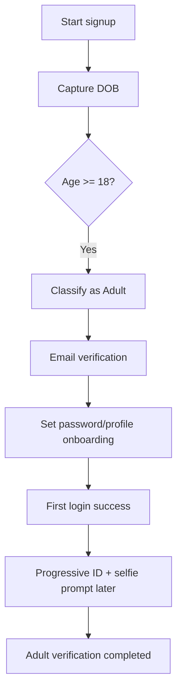
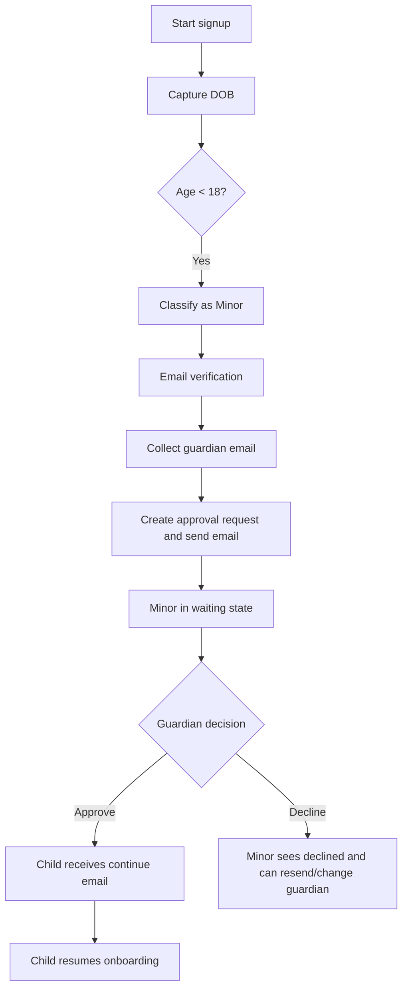
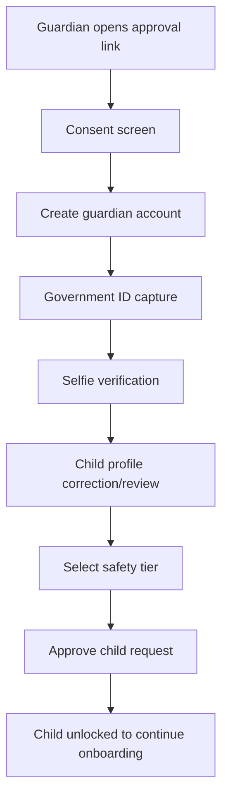
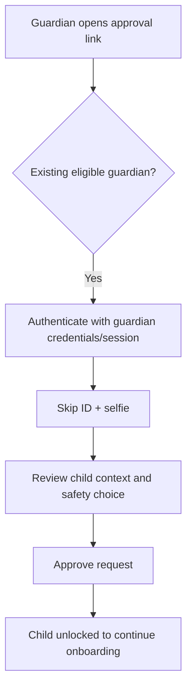
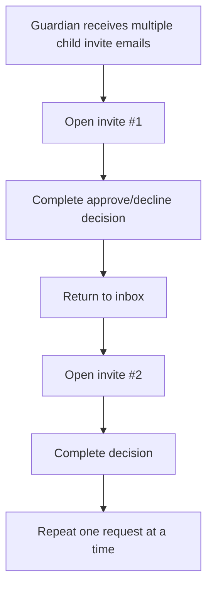

# Onboarding — User Stories, User Flows & Edge Cases

| Document | `uc-onboarding.md` |
| --- | --- |
| Module | Onboarding (Signup, Age Gate, Guardian Approval) |
| Based on | Intended product design + current implementation in `src/` and `prisma/` (as of 2026-08-24) |
| Actors | Child/Minor user, Adult user, Guardian (new), Guardian (existing), Platform |
| Primary surfaces | `/signup`, `/onboarding/*`, `/guardian/approve`, onboarding APIs |
| Related specs | `us-main-feed.md`, `us-service-requests.md` |

---

## 1. Purpose

This specification defines the onboarding product for InrCliq across:

- **User stories** (what each actor needs to do),
- **User flows** (how each journey progresses),
- **Acceptance criteria** (what must be true for each story), and
- **Edge-case handling** (safety and resiliency scenarios).

This document is written for the **intended design** from Product Owner input.  
Where current code differs, it is explicitly called out in [§8 Current implementation / gaps](#8-current-implementation--gaps-vs-intended-design).

---

## 2. Actors

| Actor | Description |
| --- | --- |
| **Adult user** | A user aged **18 or older** at signup based on date of birth (DOB). |
| **Minor user** | A user aged **under 18** at signup based on DOB. |
| **Guardian (new)** | Parent/guardian who receives a minor approval request and does not yet have an eligible guardian account. |
| **Guardian (existing)** | Parent/guardian already registered as a guardian in complete state. |
| **Platform** | InrCliq services handling email verification, invite issuance, guardian approval state, and onboarding redirects. |

---

## 3. Glossary

| Term | Definition |
| --- | --- |
| **Minor** | User under age 18 at time of evaluation. |
| **Adult** | User age 18 or older at time of evaluation. |
| **Guardian approval** | Parent/guardian action to approve or decline a minor’s signup request. |
| **Safety tier** | Guardian-selected child protection level controlling child safety defaults. Current concept supports strict/standard/relaxed; business taxonomy remains extendable. |
| **Progressive verification** | Non-blocking identity verification requested after initial onboarding completion (adult flow). |
| **Pending minor** | Minor with parent request status pending/declined/expired and not yet approved for full onboarding progression. |
| **Continue link** | Child-facing link emailed after guardian approval to resume onboarding session/state. |

---

## 4. Age determination rules

### 4.1 Product rule (intended, normative)

> Product Owner note had an inverted phrase ("Over 18 considered as minor").  
> This specification applies the **standard rule**:

- **Minor:** age < 18
- **Adult:** age >= 18

### 4.2 Evaluation method

1. Capture DOB at signup.
2. Compute age using current date at evaluation time.
3. If current date is before birth month/day in the current year, subtract one.
4. Classify user with threshold at exact 18th birthday.

### 4.3 Cutoff/timezone policy

- **Intended policy:** evaluate age using a consistent platform timezone policy (preferably UTC date boundary or clearly documented business timezone).
- **Current implementation note:** current code uses JavaScript `Date` with server/runtime local time semantics; explicit timezone normalization is not enforced.

### 4.4 18th birthday behavior

- User is minor until the day before turning 18.
- On the calendar day they turn 18 (per chosen policy), user is adult.
- If user turns 18 while still in pending minor flow, product behavior must be deterministic (see edge cases and US-ONB-B04).

---

## 5. High-level user flows

### 5.1 Adult signup (intended)

### 5.2 Minor signup

### 5.3 Guardian flow — new guardian

### 5.4 Guardian flow — already registered guardian

### 5.5 Multi-child sequential approvals

---

## 6. Epics & user stories

### Epic A — Age-gated signup foundation

#### US-ONB-A01 — Capture DOB at signup

**As a** new user  
**I want to** submit my date of birth during signup  
**So that** the platform can route me into the correct onboarding path.

**Acceptance criteria**

1. Signup requires DOB fields and validates calendar correctness.
2. Invalid or impossible DOB values are rejected with clear error.
3. DOB is persisted to user record for downstream age and safety decisions.

---

#### US-ONB-A02 — Classify users by standard age split

**As a** platform  
**I want to** classify users as minor/adult using the standard cutoff  
**So that** policy and flow rules are applied consistently.

**Acceptance criteria**

1. Users under 18 are assigned **Minor**.
2. Users 18+ are assigned **Adult**.
3. Classification is deterministic around 18th birthday boundary.
4. Classification logic is documented and testable.

---

#### US-ONB-A03 — Verify email before onboarding continuation

**As a** user  
**I want to** verify my email before progressing  
**So that** my account ownership is confirmed.

**Acceptance criteria**

1. Verification email is sent on signup for email method.
2. Unverified users cannot continue to password/handle/interests steps.
3. After successful verification, user is redirected to age-dependent next step.

---

### Epic B — Adult onboarding

#### US-ONB-B01 — Adult signup without guardian gate

**As an** adult user  
**I want to** onboard without parent approval  
**So that** I can access the product after standard signup.

**Acceptance criteria**

1. Adult users do not see guardian email or waiting screens.
2. Adult users proceed through password/profile onboarding directly.
3. Adult users can reach first login once onboarding is complete.

---

#### US-ONB-B02 — Adult progressive verification (non-blocking)

**As an** adult user  
**I want** ID/selfie verification to be requested progressively after initial access  
**So that** signup is low-friction while trust can be increased later.

**Acceptance criteria**

1. Adult ID/selfie is not required to complete first login.
2. Product defines trigger points for later verification prompts (risk, feature unlock, trust checkpoint, etc.).
3. Prompting and completion state are tracked separately from initial onboarding completion.

---

#### US-ONB-B03 — Adult re-entry redirect

**As an** adult user  
**I want** consistent redirect behavior after login/session restore  
**So that** I return to the correct step if onboarding is incomplete.

**Acceptance criteria**

1. If onboarding incomplete, user is redirected to the correct next step.
2. If complete, user lands in feed/home destination.
3. Redirect logic is centralized to avoid route divergence.

---

#### US-ONB-B04 — Minor-to-adult transition during pending flow

**As a** user who turns 18 while pending guardian approval  
**I want** clear rules for transition  
**So that** I am not stuck in contradictory onboarding state.

**Acceptance criteria**

1. Product defines whether reevaluation is automatic or user-triggered.
2. If user now qualifies as adult, guardian gate can be bypassed per policy.
3. Existing pending invites are expired/archived with audit clarity.

---

### Epic C — Minor onboarding and guardian invite

#### US-ONB-C01 — Collect guardian email for minors

**As a** minor user  
**I want to** provide my parent/guardian email  
**So that** my approval request can be initiated.

**Acceptance criteria**

1. Parent email is required for minors after email verification.
2. Child email and guardian email cannot be identical.
3. Valid email format is required.
4. Submitting creates one active pending request and sends invite email.

---

#### US-ONB-C02 — Minor waiting state and status polling

**As a** minor user  
**I want to** see pending/declined/approved status clearly  
**So that** I know what action is required.

**Acceptance criteria**

1. Pending view shows invite sent and expiry context.
2. Declined status provides clear next action (new guardian email).
3. Approved status transitions child to continuation flow.
4. Waiting users cannot bypass into feed.

---

#### US-ONB-C03 — Resend guardian invite with cooldown

**As a** minor user  
**I want to** resend the guardian email safely  
**So that** my guardian can receive a fresh link.

**Acceptance criteria**

1. Resend is rate-limited by cooldown.
2. Resend invalidates previous pending token and issues a new pending request.
3. Status and expiry metadata refresh after resend.

---

#### US-ONB-C04 — Continue child onboarding after approval

**As a** minor user  
**I want to** resume onboarding after guardian approval  
**So that** I can finish account setup.

**Acceptance criteria**

1. Approved minor receives child-facing continue link.
2. Continue link opens authenticated child context and routes to approval-confirmed step.
3. Child can proceed to password/profile steps after approval acknowledgement.

---

### Epic D — Guardian onboarding and approval

#### US-ONB-D01 — Open and validate guardian approval token

**As a** guardian  
**I want** invalid/expired/resolved links to be safely blocked  
**So that** only eligible requests are processed.

**Acceptance criteria**

1. Missing or malformed token is rejected.
2. Expired token is rejected with user-friendly message.
3. Already resolved token is blocked as already used.
4. Valid token loads child request context.

---

#### US-ONB-D02 — New guardian identity verification

**As a** new guardian  
**I want to** create account and complete ID + selfie verification  
**So that** I can be trusted to approve a child account.

**Acceptance criteria**

1. New guardian creates account with guardian email.
2. Guardian provides government-issued ID capture.
3. Guardian completes selfie verification.
4. Verification must succeed before final approval submission.

---

#### US-ONB-D03 — Existing guardian quick path

**As an** existing guardian  
**I want to** approve child requests without redoing ID/selfie  
**So that** repeat approvals are faster.

**Acceptance criteria**

1. Existing guardian is identified by eligible guardian account state.
2. Existing guardian can proceed without ID/selfie recapture.
3. Approval still records guardian linkage and safety selection.

---

#### US-ONB-D04 — Child profile correction/review by guardian

**As a** guardian  
**I want to** review/correct child profile context before approval  
**So that** child safety settings are based on accurate data.

**Acceptance criteria**

1. Guardian sees child identity summary before approval.
2. Guardian can provide correction inputs defined by product.
3. Corrections are stored/audited before final approval.

---

#### US-ONB-D05 — Assign child safety tier

**As a** guardian  
**I want to** select a safety tier for the child  
**So that** child protections match guardian preference.

**Acceptance criteria**

1. Safety tier selection is required at final approval.
2. Tier definitions are clearly explained to guardian.
3. Tier persists against approved guardian-child relationship.
4. Child runtime safety controls reference selected tier.

---

#### US-ONB-D06 — Approve or decline child request

**As a** guardian  
**I want to** approve or decline a child signup request  
**So that** platform access aligns with guardian consent.

**Acceptance criteria**

1. Approve marks request approved and unblocks child progression.
2. Decline marks request declined and notifies child.
3. Request resolution is timestamped and auditable.

---

### Epic E — Multiple child approvals

#### US-ONB-E01 — Sequential handling of multiple requests

**As a** guardian of multiple children  
**I want** each child request handled independently, one at a time  
**So that** each approval has distinct intent and audit trail.

**Acceptance criteria**

1. Each child invite is sent as a separate email/request.
2. Guardian can resolve each request independently.
3. One request resolution does not auto-resolve others.

---

### Epic F — Access control and safety enforcement

#### US-ONB-F01 — Pending minors are session-locked from full product

**As a** platform  
**I want** pending minors blocked from full feed usage  
**So that** consent requirements are enforced.

**Acceptance criteria**

1. Pending/declined/expired minors cannot access full product destinations.
2. Authenticated pending minors are redirected to onboarding waiting/parent steps.
3. Access is unlocked only after guardian approval and child continuation steps.

---

#### US-ONB-F02 — Logged-in adults handling child invites

**As a** logged-in adult clicking a child invite  
**I want** safe, deterministic handling  
**So that** account/session confusion is avoided.

**Acceptance criteria**

1. Product enforces guardian eligibility checks before allowing approval action.
2. If active session conflicts with invite identity, product prompts explicit re-auth or account switch.
3. Invite actions are always bound to the token/request, not ambient UI assumptions.

---

## 7. Edge cases and expected handling

| Edge case | Expected behavior (intended) | Current implementation note |
| --- | --- | --- |
| Invalid DOB format/date | Block signup submit and show field error | Implemented with DOB parsing/validation |
| Future DOB | Reject as invalid DOB | Validation should enforce; verify rule coverage in shared validator |
| User is exactly 18 today | Classify as adult | Implemented by age calculation rule (`age < 18` => minor) |
| 17 turning 18 mid-flow | Reevaluate policy and allow deterministic transition path | Partial workaround exists via "I'm actually 18+" action; no automatic reevaluation job |
| Guardian email equals child email | Reject with explicit error | Implemented |
| Guardian email bounces | Show resend/change guardian path and preserve pending state | UI supports resend/change; bounce telemetry not explicit |
| Guardian declines | Mark declined and notify child with retry path | Implemented |
| Wrong guardian selected | Minor can send to different guardian email | Implemented via change/resend flow |
| Guardian is also a minor | Must not be eligible guardian approver | Existing-guardian quick path requires `AccountType.GUARDIAN` complete; non-guardian blocked from that path |
| Existing pending request then resend | Prior pending request expires; new pending request issued | Implemented |
| Invite token expired | Block approval and require resend from child | Implemented |
| Already resolved token reused | Show already used/resolved response | Implemented |
| Existing guardian quick-approves | Skip ID/selfie recapture | Implemented |
| New guardian ID verification fails | Guardian remains unapproved; can retry verification steps | UI flow simulates capture; hard verification failure integration is TBD |
| New guardian selfie verification fails | Guardian remains unapproved; can retry selfie | UI supports multi-step flow; backend anti-spoof integration TBD |
| Duplicate guardian account creation | Block and request login where account already exists | Implemented |
| Multiple children same guardian | Separate requests handled independently | Supported by request model; guardian UX sequencing is manual (email-by-email) |
| Already-logged-in adult clicks invite | Require deterministic account/token checks | Token-bound flow exists; explicit account-switch UX not fully implemented |
| Minor attempts to post/access feed before approval | Redirect to onboarding flow (waiting/parent) | Onboarding redirect logic enforces this when navigating via guarded routes |
| COPPA-ish consent evidence | Store approval status, resolved time, guardian linkage, protection level | Core fields exist; formal compliance reporting/audit exports TBD |
| Resend spam | Enforce cooldown and status controls | Implemented with cooldown and 429 behavior |

---

## 8. Current implementation / gaps vs intended design

Stories above define intended behavior. Current code status:

| Area | Current implementation | Gap vs intended design |
| --- | --- | --- |
| Age split rule | Uses `age < 18` => `MINOR`; else `ADULT` | Matches intended standard rule |
| Adult signup path | Adults proceed email verify -> password -> handle -> interests -> complete | Matches core flow |
| Adult signup ID/selfie | Not required at signup | Matches intended non-blocking signup |
| Adult progressive verification prompt | No explicit later-stage adult prompt/orchestration in onboarding module | **Gap**: progressive verification trigger stories not implemented yet |
| Minor guardian invite | Implemented (`parent-invite`, waiting, resend, cooldown, token expiry) | Mostly aligned |
| Existing guardian quick path | Implemented (`isReturningGuardian`, quick approve without ID/selfie) | Aligned |
| New guardian flow | Account creation + ID/selfie-like multi-step + protection tier + approval | Mostly aligned; identity checks are simulation-first |
| Child profile correction before approval | Review/location/protection context exists | **Partial gap**: broader correction model may need expansion |
| Safety tier | Implemented as `strict/standard/relaxed` (`protectionLevel`) | If product wants different tier taxonomy, values are **TBD** |
| Multi-child sequential handling | Data model supports many requests; handled independently | No unified guardian queue UI; sequence is currently email-driven |
| Timezone/cutoff policy | Uses runtime local `Date` semantics | **Gap**: explicit platform timezone policy not formalized |
| Session lock for pending minors | Redirect logic routes minors to parent/waiting until approved | Aligned at app-route level |
| Compliance/audit depth | Stores statuses, timestamps, guardian linkage, tokens | Formal legal/compliance reporting layer not present |

---

## 9. Out of scope (for this specification)

1. Detailed legal interpretation beyond provided product direction.
2. Payments, billing, or monetization implications.
3. Seller verification/business verification flows unrelated to onboarding age gate.
4. Non-onboarding trust systems not explicitly tied to these stories.

---

## 10. Story ID index

| ID | Title | Primary actor |
| --- | --- | --- |
| US-ONB-A01 | Capture DOB at signup | User |
| US-ONB-A02 | Classify users by standard age split | Platform |
| US-ONB-A03 | Verify email before continuation | User |
| US-ONB-B01 | Adult signup without guardian gate | Adult user |
| US-ONB-B02 | Adult progressive verification | Adult user |
| US-ONB-B03 | Adult re-entry redirect | Adult user |
| US-ONB-B04 | Minor-to-adult transition mid-flow | User / Platform |
| US-ONB-C01 | Collect guardian email for minors | Minor user |
| US-ONB-C02 | Minor waiting state | Minor user |
| US-ONB-C03 | Resend guardian invite | Minor user |
| US-ONB-C04 | Continue after guardian approval | Minor user |
| US-ONB-D01 | Validate guardian approval token | Guardian |
| US-ONB-D02 | New guardian identity verification | New guardian |
| US-ONB-D03 | Existing guardian quick path | Existing guardian |
| US-ONB-D04 | Child profile correction/review | Guardian |
| US-ONB-D05 | Assign child safety tier | Guardian |
| US-ONB-D06 | Approve or decline child request | Guardian |
| US-ONB-E01 | Sequential multi-child approvals | Guardian |
| US-ONB-F01 | Session lock for pending minors | Platform |
| US-ONB-F02 | Logged-in adult invite handling | Platform / Guardian |

---

## 11. Revision

| Version | Date | Notes |
| --- | --- | --- |
| 1.0 | 2026-08-24 | Initial onboarding BA specification (user stories, flows, edge cases, and intended-vs-current mapping) |

