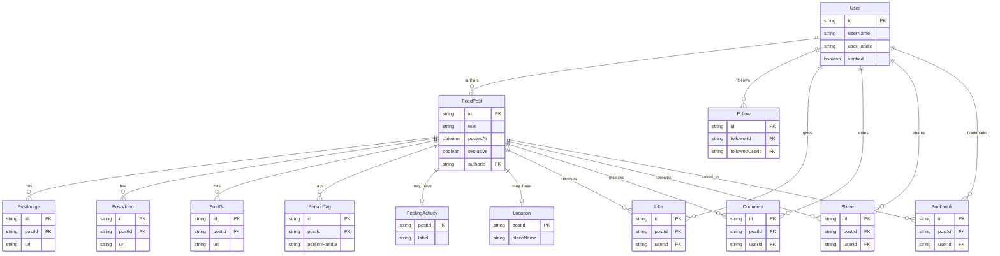

# Regular Feed Post

Brief feature list for a regular Main Feed post.

---

## ERD

---

## 1. Add to your post

What the author can attach when creating a post.

### 1.1 Text
Short or longer caption / description lines on the post.

### 1.2 Images
One photo or several photos in the same post.

### 1.3 Videos
One video or several videos in the same post.

### 1.4 Tag people
Mention / tag other people on the post.

### 1.5 Feeling / activity
Add how the author feels or what they are doing.

### 1.6 Location (check-in)
Tag a place where the post is from.

### 1.7 GIF
Pick a GIF from the library and add it to the post.

---

## 2. Posted date / time
Shows when the post was published in relative form (e.g. Just now, 2h, 30m, 1d, 4w).

## 3. Likes
Like icon plus like count. The control supports a maximum number of clicks.

## 4. Comments
Shows how many comments the post has.

## 5. User name
Author’s display name.

## 6. User handle
Author’s @handle.

## 7. Verified state
If the author is verified, a star icon is shown.

## 8. Follow user
Button to follow that author.

## 9. Share
Share icon to share the post.

## 10. Bookmark
Bookmark icon to save the post.

## 11. Exclusive content flag
Yes / No flag showing whether the post is exclusive (members-only) content.

---

## User stories — adding a feed item

Actors:

- **Normal user** — signed-in member who is not verified.
- **Verified user** — signed-in member with verified status (star).

---

### US-FEED-ADD-01 — Open create post (normal or verified)

**As a** normal or verified user  
**I want to** open “Add to your post”  
**So that** I can compose a new feed item.

**Acceptance criteria**

1. I can open the create-post composer from the feed.
2. The composer shows the add-to-post options listed in §1.

---

### US-FEED-ADD-02 — Add text to a post

**As a** normal or verified user  
**I want to** add lines or a description of text  
**So that** my post has a caption.

**Acceptance criteria**

1. I can enter one or more lines of text.
2. I can publish with text only, or with text plus other add-ons.

---

### US-FEED-ADD-03 — Add images to a post

**As a** normal or verified user  
**I want to** add a single image or multiple images  
**So that** my post can show photos.

**Acceptance criteria**

1. I can attach one image.
2. I can attach more than one image on the same post.
3. Images can be combined with text and other add-ons.

---

### US-FEED-ADD-04 — Add videos to a post

**As a** normal or verified user  
**I want to** add a single video or multiple videos  
**So that** my post can show video content.

**Acceptance criteria**

1. I can attach one video.
2. I can attach more than one video on the same post.
3. Videos can be combined with text, images, and other add-ons.

---

### US-FEED-ADD-05 — Tag people

**As a** normal or verified user  
**I want to** tag people into the post  
**So that** those people are linked on my post.

**Acceptance criteria**

1. I can search/select people to tag.
2. Tagged people are saved with the post when I publish.

---

### US-FEED-ADD-06 — Add feeling / activity

**As a** normal or verified user  
**I want to** add a feeling or activity tag  
**So that** viewers see what I’m feeling or doing.

**Acceptance criteria**

1. I can choose a feeling or activity.
2. The feeling/activity is shown on the published post.

---

### US-FEED-ADD-07 — Check in with a location

**As a** normal or verified user  
**I want to** tag a location (check-in)  
**So that** viewers know where the post is from.

**Acceptance criteria**

1. I can select a location for the post.
2. The location is shown on the published post.

---

### US-FEED-ADD-08 — Add a GIF from the library

**As a** normal or verified user  
**I want to** tag a GIF from the library  
**So that** my post includes an animated GIF.

**Acceptance criteria**

1. I can browse/select a GIF from the library.
2. The GIF is included when I publish.

---

### US-FEED-ADD-09 — Publish as a normal user

**As a** normal user  
**I want to** publish my feed item  
**So that** it appears on the Main Feed with my identity.

**Acceptance criteria**

1. After publish, the post shows my user name and user handle.
2. Verified star is **not** shown on my post (I am not verified).
3. Exclusive content flag is **No** — I cannot mark the post as exclusive.
4. Posted date/time shows in relative form (e.g. Just now).
5. Likes, comments, share, and bookmark controls are available on the post for viewers.
6. Other users see a Follow button on my post.

---

### US-FEED-ADD-10 — Publish as a verified user

**As a** verified user  
**I want to** publish my feed item  
**So that** it appears on the Main Feed with my verified identity and optional exclusive content.

**Acceptance criteria**

1. After publish, the post shows my user name and user handle.
2. Verified state is shown with a **star icon**.
3. I can set Exclusive content flag to **Yes** or leave it **No**.
4. If Exclusive = Yes, the post is treated as members-only exclusive content.
5. Posted date/time shows in relative form (e.g. Just now).
6. Likes, comments, share, and bookmark controls are available on the post for viewers.
7. Other users see a Follow button on my post.

---

### US-FEED-ADD-11 — Exclusive content only for verified users

**As a** normal user  
**I want** exclusive posting to be unavailable to me  
**So that** only verified users can publish exclusive content.

**Acceptance criteria**

1. Normal user composer does not allow Exclusive = Yes.
2. Verified user composer allows Exclusive = Yes / No.
3. Published exclusive posts show Exclusive content flag = Yes.

---

### US-FEED-ADD-12 — Combined add-ons on one post

**As a** normal or verified user  
**I want to** combine several add-to-post options in one item  
**So that** a single post can include text, media, tags, and context together.

**Acceptance criteria**

1. I can publish any allowed combination of text, images, videos, people tags, feeling/activity, location, and GIF.
2. All selected add-ons appear on the published feed item.
3. Verified-only exclusive flag still follows US-FEED-ADD-10 / US-FEED-ADD-11.
