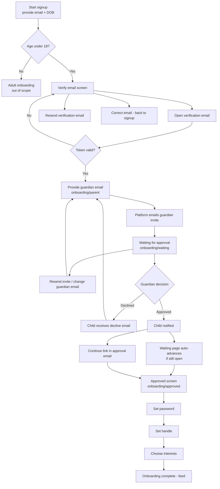
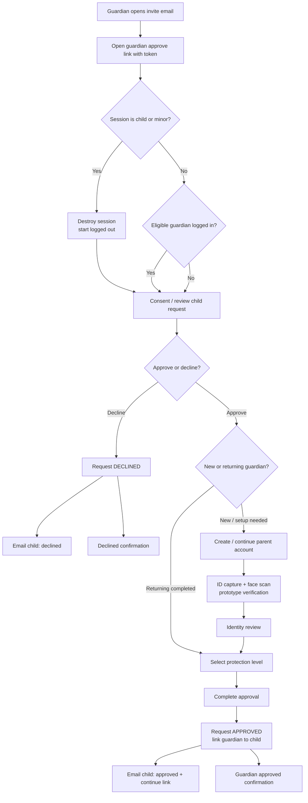
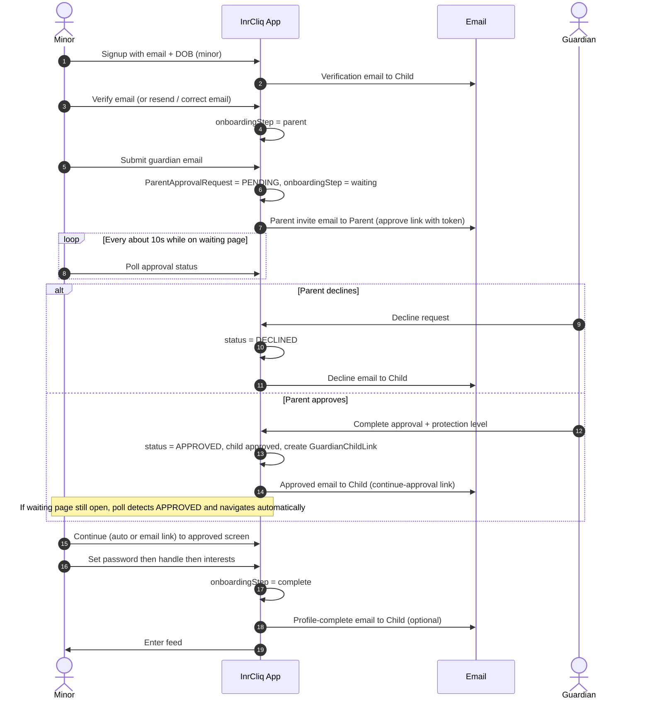

# Child Onboarding & Guardian Approval — User Stories & Flows

| Document | `us-child-onboarding-and-approval.md` |
| --- | --- |
| Module | Minor signup, email verification, guardian invite, approval / decline, post-approval profile setup |
| Based on | Current implementation in `src/` and `prisma/` (as of 2026-09-07) |
| Actors | Minor (child), Guardian (new), Guardian (returning), Platform |
| Primary surfaces | `/signup`, `/onboarding/parent`, `/onboarding/waiting`, `/onboarding/approved`, `/onboarding/password`, `/onboarding/handle`, `/onboarding/interests`, `/guardian/approve` |
| Related specs | `uc-onboarding.md`, `ba-family-center.md` |

---

## 1. Purpose

This document describes the **implemented** child (minor) onboarding journey and the linked guardian approval journey:

- What the minor and guardian can do (user stories)
- How the journey progresses (user flows + sequence)
- When emails are sent (triggers)
- How approval / decline is reflected back to the child (polling + continue link)

**Age rule (implemented):** DOB at signup → age **&lt; 18** ⇒ `AccountType.MINOR`; age **≥ 18** ⇒ adult path (out of scope for this document).

---

## 2. Actors

| Actor | Description |
| --- | --- |
| **Minor** | User under 18 who must complete guardian approval before finishing onboarding. |
| **Guardian (new)** | Parent/guardian invited by email who does not yet have a completed guardian account. |
| **Guardian (returning)** | Parent/guardian already registered as a completed guardian for the invite email. |
| **Platform** | InrCliq services for verification, invites, approval state, redirects, and email delivery. |

---

## 3. End-to-end overview

### 3.1 Child journey (happy path)

1. Minor provides email (and signup details including DOB).
2. Minor verifies email.
   - Can **resend** verification email.
   - Can **correct** email and restart verification.
3. Minor provides guardian’s email.
4. Minor waits for parent approval.
5. **Branch**
   - **Rejected:** child receives decline email; can invite again / change guardian email.
   - **Approved:** parent completes approval; child receives continue email **and/or** waiting screen auto-advances to approved.
6. Child specifies a password.
7. Child specifies a handle.
8. Child specifies interests → onboarding complete → feed.

### 3.2 Guardian journey (happy path)

1. Guardian opens approval link from invite email (`/guardian/approve?token=…`).
2. Reviews consent / child request summary.
3. Creates parent account **or** continues as logged-in eligible guardian.
4. Completes identity verification steps (prototype: simulated ID + selfie).
5. Reviews identity details.
6. Selects protection level (strict / standard / relaxed).
7. Approves → child notified; guardian sees confirmation.

---

## 4. User stories

### US-CHILD-01 — Provide email & start signup

**As a** minor  
**I want to** enter my signup details including email and date of birth  
**So that** the platform can classify me as a minor and start verification.

**Acceptance criteria**

- DOB is required and age is computed at join time.
- Age &lt; 18 creates / updates a `MINOR` account.
- Unverified minors are directed into email verification (not the adult password-first path).

---

### US-CHILD-02 — Verify email

**As a** minor  
**I want to** verify ownership of my email  
**So that** the platform trusts my contact address before involving a guardian.

**Acceptance criteria**

- Platform sends a verification email with a one-time link/token.
- Successful verify sets onboarding to guardian invite (`onboardingStep = parent`) and opens `/onboarding/parent`.
- Invalid / expired tokens show an error path (verify-email error surface).

---

### US-CHILD-03 — Resend verification email

**As a** minor  
**I want to** resend the verification email  
**So that** I can continue if the first message was missed or delayed.

**Acceptance criteria**

- Resend is available from the verification UI.
- Resend is rate-limited (cooldown ≈ 30 seconds).
- A new verification email is sent to the current child email.

---

### US-CHILD-04 — Correct email

**As a** minor  
**I want to** change my email if I mistyped it  
**So that** I can verify the correct address.

**Acceptance criteria**

- Child can leave verification and return to the join/email entry form.
- Prior verification session keys are cleared on change-email.
- Verification must be completed for the new email before guardian invite.

---

### US-CHILD-05 — Provide guardian email

**As a** minor  
**I want to** enter my parent/guardian’s email  
**So that** they can approve my account.

**Acceptance criteria**

- Guardian email is required on `/onboarding/parent`.
- Guardian email must not equal the child’s email.
- On success, platform creates a `ParentApprovalRequest` (`PENDING`), emails the guardian, and sets child `onboardingStep = waiting`.
- Child is taken to `/onboarding/waiting`.

---

### US-CHILD-06 — Wait for guardian approval

**As a** minor  
**I want to** wait while my guardian reviews the request  
**So that** I know when I can continue.

**Acceptance criteria**

- Waiting page shows pending state and guardian email context.
- Child can resend the invite (cooldown ≈ 30 seconds) or change guardian email (return to `/onboarding/parent`).
- Waiting page polls approval status about every **10 seconds**.
- If status becomes `APPROVED` while the child stays on the page, UI navigates to `/onboarding/approved` automatically.
- Server redirects already-approved minors away from waiting toward `/onboarding/approved`.

---

### US-CHILD-07 — Receive decline and recover

**As a** minor  
**I want to** be notified if my guardian declines  
**So that** I can invite another guardian or try again.

**Acceptance criteria**

- On decline, request status becomes `DECLINED`.
- Child receives a decline email.
- Waiting UI surfaces decline and offers a path back to `/onboarding/parent` to send a new invite.
- Sending a new invite expires prior `PENDING` requests for that child.

---

### US-CHILD-08 — Continue after approval

**As a** minor  
**I want to** continue onboarding after my guardian approves  
**So that** I can finish setting up my account.

**Acceptance criteria**

- On approval, child `onboardingStep` becomes `approved`.
- Child receives an approval email with a continue link (`/api/onboarding/continue-approval?token=…`).
- Continue link establishes / resumes the child session and lands on `/onboarding/approved`.
- If the child remained on the waiting page, auto-advance reaches the same approved screen without requiring the email link.

---

### US-CHILD-09 — Set password

**As a** minor  
**I want to** create a password after approval  
**So that** I can secure my account for future sign-in.

**Acceptance criteria**

- Available after acknowledgement of approval (`/onboarding/password`).
- Password rules match platform signup requirements (min length + letter/number mix).
- Success advances `onboardingStep` to `handle`.

---

### US-CHILD-10 — Set handle

**As a** minor  
**I want to** choose a unique handle  
**So that** others can identify my account.

**Acceptance criteria**

- Handle uniqueness is enforced.
- Success advances `onboardingStep` to `interests`.

---

### US-CHILD-11 — Choose interests

**As a** minor  
**I want to** pick interests  
**So that** my feed experience can be personalised.

**Acceptance criteria**

- Interests step completes onboarding (`onboardingStep = complete`).
- Child is redirected into the authenticated feed (`/feed`).
- Platform may send a profile-complete email.

---

### US-GUARD-01 — Open approval invite

**As a** guardian  
**I want to** open the emailed approval link  
**So that** I can review my child’s signup request.

**Acceptance criteria**

- Invite email contains `/guardian/approve?token=…`.
- Invalid / expired / already-used links show clear errors.
- If the **child’s session** is still active in the same browser, platform logs that session out so the flow does not show “logged in as” the child.
- Eligible logged-in guardian (invite email match or guardian account) may continue as existing account; otherwise flow starts logged out / create-account.

---

### US-GUARD-02 — Approve child with protection level

**As a** guardian  
**I want to** approve the request and choose a protection level  
**So that** the child can continue under appropriate defaults.

**Acceptance criteria**

- New guardians complete account + identity verification + review + protection selection.
- Returning completed guardians can skip to protection after consent.
- Approval sets request `APPROVED`, links guardian↔child, notifies child, and shows guardian confirmation.

---

### US-GUARD-03 — Decline child request

**As a** guardian  
**I want to** decline a request that looks wrong  
**So that** the child account is not activated under my email.

**Acceptance criteria**

- Decline is available from the approval flow.
- Request becomes `DECLINED` and child is emailed.
- Guardian can leave the flow after confirmation.

---

## 5. User flow diagrams

### 5.1 Child onboarding + approval (Mermaid)

### 5.2 Guardian approval (Mermaid)

### 5.3 Sequence — emails & state (Mermaid)

---

## 6. Email triggers

| # | Trigger event | Recipient | Purpose | Typical deep link |
| --- | --- | --- | --- | --- |
| 1 | Minor submits signup / resends verification | Child | Verify email ownership | Verify-email token URL |
| 2 | Minor submits / resends guardian invite | Guardian | Review & approve/decline child | `/guardian/approve?token=…` |
| 3 | Guardian declines | Child | Inform decline; invite again | Onboarding / parent invite recovery |
| 4 | Guardian approves | Child | Continue onboarding after approval | `/api/onboarding/continue-approval?token=…` |
| 5 | Child completes interests | Child | Confirm profile setup complete | Feed / home |

**Implementation notes (current code)**

| Email | Sender helper (approx.) | Fired from |
| --- | --- | --- |
| Verification | `sendVerificationEmail` | Signup join + verify resend |
| Parent invite | `sendParentInviteEmail` | Parent invite + invite resend |
| Child declined | `sendParentDeclinedChildEmail` | Guardian decline |
| Child approved | `sendParentApprovedChildEmail` via `notifyChildOfParentApproval` | Guardian complete / approve side effects |
| Profile complete | `sendProfileCompleteEmail` | Interests completion |

**Timing / token policy (current)**

| Item | Value |
| --- | --- |
| Verification / invite resend cooldown | ≈ 30 seconds |
| Parent invite token expiry | ≈ 24 hours |
| Child continue-after-approval token | ≈ 72 hours |
| Waiting-page status poll | ≈ every 10 seconds |

---

## 7. State model (implemented)

### 7.1 Child `onboardingStep` progression

| Step value | Meaning | Primary surface |
| --- | --- | --- |
| *(pre-verify)* | Account created, email not verified | Signup verify UI |
| `parent` | Email verified; needs guardian email | `/onboarding/parent` |
| `waiting` | Invite sent; awaiting guardian | `/onboarding/waiting` |
| `approved` | Guardian approved; child can continue | `/onboarding/approved` |
| `password` | Setting password | `/onboarding/password` |
| `handle` | Choosing handle | `/onboarding/handle` |
| `interests` | Choosing interests | `/onboarding/interests` |
| `complete` | Onboarding finished | `/feed` |

### 7.2 `ParentApprovalRequest.status`

| Status | Meaning |
| --- | --- |
| `PENDING` | Awaiting guardian decision |
| `APPROVED` | Guardian approved; child may continue |
| `DECLINED` | Guardian declined |
| `EXPIRED` | Superseded when a newer invite is created for the same child |

---

## 8. Screen / API map (implementation)

### 8.1 Child surfaces

| Surface | Role |
| --- | --- |
| `/` or `/signup` | Signup + email verification UI |
| `/onboarding/parent` | Guardian email capture |
| `/onboarding/waiting` | Pending / declined waiting + poll |
| `/onboarding/approved` | Post-approval acknowledgement |
| `/onboarding/password` | Password setup |
| `/onboarding/handle` | Handle setup |
| `/onboarding/interests` | Interests + completion |

### 8.2 Guardian surfaces

| Surface | Role |
| --- | --- |
| `/guardian/approve?token=…` | Full guardian approval flow |

### 8.3 Key APIs

| API | Role |
| --- | --- |
| `POST /api/auth/signup/join` | Create/join signup; send verification |
| `GET /api/auth/verify-email` | Consume verify token |
| `POST /api/auth/verify-email/resend` | Resend verification |
| `POST /api/onboarding/parent-invite` | Create invite + email guardian |
| `GET/POST /api/onboarding/parent-invite/resend` | Poll status / resend invite |
| `GET /api/onboarding/continue-approval` | Child continue link after approval |
| `POST /api/onboarding/acknowledge-approval` | Move approved → password |
| `POST /api/onboarding/password` | Save password |
| `POST /api/onboarding/handle` | Save handle |
| `POST /api/onboarding/interests` | Save interests → complete |
| `GET /api/guardian/context` | Load approval context; clear child session if needed |
| `POST /api/guardian/account` | Create/setup guardian account |
| `POST /api/guardian/complete` | Finalise approval + protection level |
| `POST /api/guardian/decline` | Decline request |

---

## 9. Edge cases covered by current product

| Scenario | Behaviour |
| --- | --- |
| Mistyped child email | Correct email and re-verify |
| Missed verification / invite email | Resend with cooldown |
| Guardian email equals child email | Rejected |
| Child stays on waiting page during approval | Auto-navigate to approved when poll sees `APPROVED` |
| Child closed browser after approval | Use continue link from approval email |
| Guardian declines | Decline email + recovery via new invite |
| New invite while one is pending | Prior pending invite expires |
| Child still logged in when opening parent approve link | Session destroyed; approval starts logged out |
| Returning completed guardian | Can skip to protection after consent |
| “I’m actually 18+” correction | Supported path to flip to adult onboarding (related escape hatch) |

---

## 10. Out of scope for this document

- Full adult onboarding (non-minor path)
- Family Circle post-link controls beyond approval linking
- Production-grade identity verification (current guardian ID/selfie steps are prototype/simulated)
- Multi-guardian / additional guardian invites
- Market-specific legal age rules beyond the hard &lt; 18 minor gate

---

## 11. Related code entry points

| Area | Paths |
| --- | --- |
| Child onboarding UI | `src/components/onboarding/*`, `src/components/auth/SignupFlow.tsx` |
| Guardian UI | `src/components/guardian/GuardianFlow.tsx` and step components |
| Redirect / step gating | `src/lib/auth/onboarding.ts` |
| Invites & continue tokens | `src/lib/auth/parent-invite.ts` |
| Guardian business logic | `src/lib/auth/guardian-flow.ts` |
| Emails | `src/lib/email/notifications.ts`, `src/lib/email/templates.ts` |
| Data model | `ParentApprovalRequest`, `ApprovalStatus`, `GuardianChildLink` in `prisma/schema.prisma` |
