# DM Safety — Guardian Review by Age Zone — User Stories, Flows & Test Cases

| Document | `us-dm-safety-guardian-review.md` |
| --- | --- |
| Module | Direct Messaging safety: moderation, guardian review holds, sender enforcement, guardian alerts, reports, audit |
| Based on | Implementation shipped in commit `1470d79` (2026-09-27) |
| Actors | Sender (adult), Sender (minor), Recipient (child), Guardian, Co-guardian, Platform |
| Primary surfaces | `/feed/messages`, `/family-circle/alerts`, `/family-circle` (Overview), `/family-circle/activity`, `/family-circle/accounts/[childId]/dm/[threadId]` |
| Related specs | `impl-dm-safety-guardian-review.md` (technical spec), `2026-09-22_Family-Circle-DM-Safety-Workflow-by-Age-Zone_updatedHK (1).docx` (BA source), `ba-family-center.md` |

---

## 1. Purpose

This document describes the **implemented** DM safety workflow from the user's point of view:

- What each actor can do (user stories with acceptance criteria)
- How each scenario flows (Mermaid flow diagrams)
- How to verify each scenario (manual test cases, with the automated test that covers it where one exists)

It covers every path through the DM safety policy (rules R1–R8 in `impl-dm-safety-guardian-review.md` §3), the guardian decision journey, sender enforcement, hold expiry, and the guardian-messaging-own-child rule.

**Out of scope:** images, video and live content in DMs (Phase 2), human moderator console for reports (Phase 2), comments and posts moderation.

---

## 2. Actors

| Actor | Description |
| --- | --- |
| **Sender (adult)** | Any 18+ account sending a DM. Can receive strikes and minors-only restrictions. |
| **Sender (minor)** | Under-18 account sending a DM. Never receives strikes; their guardians are informed instead. |
| **Recipient (child)** | Under-18 account receiving a DM. Treatment depends on age zone and whether they are monitored. |
| **Guardian** | Adult linked to the child through Family Circle. Reviews held messages, blocks, reports. |
| **Co-guardian** | A second guardian linked to the same child. Sees the same alerts; the first decision wins. |
| **Platform** | Azure Content Safety moderation, hold/expiry logic, nightly cron, audit trail, safety team queue. |

---

## 3. Key concepts

### 3.1 Age zones

| Zone | Ages | Recipient treatment for a held sexual message |
| --- | --- | --- |
| `KIDS` | under 13 | **Withheld** — the child sees nothing until a guardian allows it |
| `TEENS` | 13–15 | **Withheld** |
| `MATURE_TEENS` | 16–17 | **Masked placeholder** — the child sees "Hidden for safety" until a guardian decides |
| `ADULT` | 18+ | Not held; existing masked-delivery behaviour |

Zone comes from date of birth. A `MINOR` account with no DOB is treated as `KIDS`; any other account with no DOB as `ADULT`.

### 3.2 Terms

| Term | Meaning |
| --- | --- |
| **Flagged** | Azure Content Safety scored the text at severity ≥ 2 in a category, or (minor recipients only) it matched the solicitation word list. |
| **Monitored** | The recipient is a minor with at least one linked guardian **other than the sender**. |
| **Hold** | A flagged message kept out of the child's inbox until a guardian allows or rejects it, or it expires after 7 days. |
| **Strike** | A record against an adult sender when they choose "Send anyway" on a sexual message to a monitored minor. Voided if a guardian allows the message. |
| **Minors-only restriction** | A block on messaging any under-18 account. 7 days at 2 strikes in 30 days; indefinite pending review at 3. |
| **Light mask** | Guardian view of a held message with explicit words reduced to first letter + asterisks and emails, phone numbers, links and @handles hidden. |

### 3.3 Privacy rules that apply to every scenario

- The child **never** receives the raw text of a held message unless a guardian allows it.
- Anyone messaging a minor is **never** told the category, severity, or that a guardian is involved.
- Guardians see raw content **only** by choosing "View message", and then only light-masked. Every view is audited.
- Alert cards, activity entries and audit records **never** contain message text.
- Held bodies are purged 30 days after Allow, or 90 days after Reject/Expiry unless an open report needs them.

---

## 4. Decision overview

Every DM goes through this decision before anything is delivered. Rules are evaluated top to bottom; the first match wins.

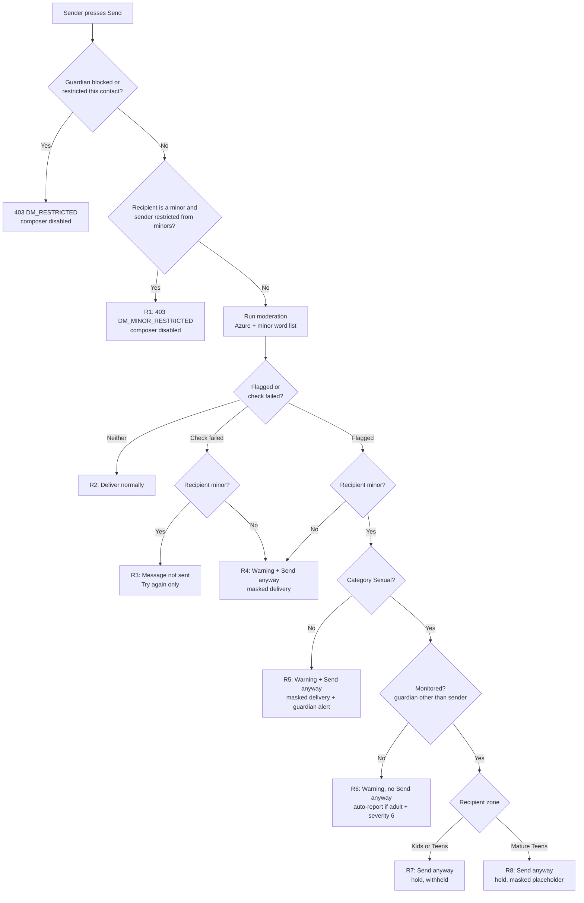

---

## 5. Test data (shared by all test cases)

Create these accounts in a non-production environment. Ages are set through date of birth.

| Persona | Account type | Age / zone | Links |
| --- | --- | --- | --- |
| **Alex** | ADULT | 32 / Adult | — |
| **Ben** | ADULT | 30 / Adult | — (second adult, used for adult-to-adult and escalation) |
| **Kiki** | MINOR | 10 / Kids | Guardians: Gina, Grant |
| **Theo** | MINOR | 14 / Teens | Guardian: Gina |
| **Tara** | MINOR | 17 / Mature Teens | Guardian: Gina |
| **Owen** | MINOR | 9 / Kids | No guardian (unmonitored) |
| **Mia** | MINOR | 15 / Teens | Guardian: Grant only |
| **Gina** | GUARDIAN | 41 / Adult | Kiki, Theo, Tara |
| **Grant** | GUARDIAN | 43 / Adult | Kiki, Mia |
| **Sam** | GUARDIAN | 45 / Adult | No children (unlinked guardian, for access checks) |

**Sample texts**

| Name | Text | Expected moderation |
| --- | --- | --- |
| `CLEAN` | "Hey, are you coming to practice on Saturday?" | Passes |
| `SEXUAL` | "you look sexy, send nudes" | Flagged, Sexual, severity 2 |
| `SEXUAL_CONTACT` | "you look sexy, send nudes to my number 0771234567" | Flagged, Sexual (light mask hides the phone number) |
| `HARASS` | A message Azure scores as Hate at severity ≥ 2 | Flagged, non-Sexual |

To force an expiry without waiting 7 days, set the hold's `expiresAt` to the past in the database, then open the guardian's alerts page (lazy expiry) or call the cron endpoint.

---

## 6. Scenarios

Test case columns: **Pre** = preconditions, **Steps**, **Expected**. "Auto" names the automated test in `tests/dm-guardian-review.integration.test.ts` (INT) or `tests/dm-safety-policy.test.ts` (UNIT) that covers the case.

---

### S1 — Clean message (baseline)

#### US-DM-01 — Send a normal message

**As a** sender  
**I want** normal messages to arrive immediately  
**So that** safety checks don't get in the way of everyday conversation.

**Acceptance criteria**

- Messages that pass moderation are delivered immediately with no warning, to any age zone.
- No alert, hold, strike or audit entry is created.

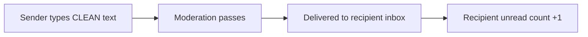

| ID | Pre | Steps | Expected | Auto |
| --- | --- | --- | --- | --- |
| TC-S1-01 | Alex has a thread with Kiki | Send `CLEAN` | Delivered at once; Kiki sees it; no warning; no alert for Gina/Grant | UNIT R2 |
| TC-S1-02 | Alex has a thread with Ben | Send `CLEAN` | Delivered; no warning | — |

---

### S2 — Adult sends a sexual message to a monitored Kids/Teens child (withheld hold)

#### US-DM-02 — Be warned before sending something inappropriate to a minor

**As an** adult sender  
**I want to** be warned when my message is flagged  
**So that** I can edit it before it reaches a child.

**Acceptance criteria**

- A warning panel appears above the composer with title **"Message blocked"** and the text "This message has been blocked due to our policy guidelines when interacting with a minor. You have the option to edit the message or send it anyway."
- The panel shows **Edit message** and **Send anyway**.
- No category, severity or mention of guardians is shown — in the UI **or** in the API response (`category: ""`, `confidence: 0`, `sendAnywayOutcome: null`).
- Nothing is saved or delivered until the sender chooses **Send anyway**.

#### US-DM-03 — Send anyway puts the message on hold

**As an** adult sender  
**I want to** know my message didn't go through straight away  
**So that** I understand it's being reviewed.

**Acceptance criteria**

- After **Send anyway** the message appears in the sender's thread with the label **"Pending review"**.
- A notice explains the consequence of strikes (see S11).
- The child (Kids/Teens) gets **no thread, no message and no unread count**.
- One decision alert per linked guardian is created with status **"Awaiting your decision"**.
- The sender receives a strike (first strike = warning notice).

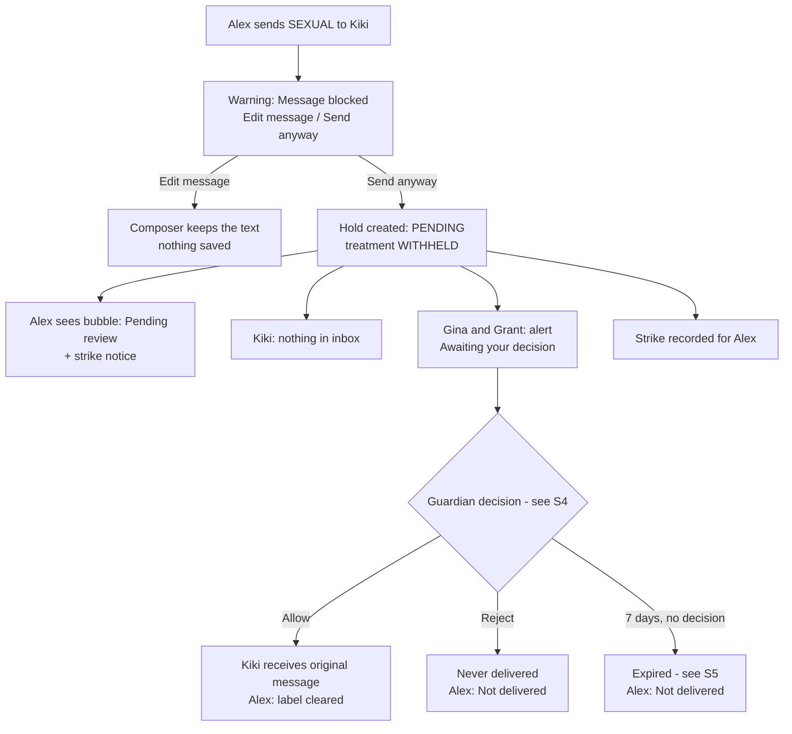

| ID | Pre | Steps | Expected | Auto |
| --- | --- | --- | --- | --- |
| TC-S2-01 | Alex → Kiki thread | Send `SEXUAL` | Warning "Message blocked" with Edit message + Send anyway; no category/severity shown | INT end-to-end send |
| TC-S2-02 | TC-S2-01 warning shown | Inspect the 422 response in devtools | `category` is `""`, `confidence` is `0`, `sendAnywayOutcome` is `null`, `recipientIsMinor` is `true` | INT end-to-end send |
| TC-S2-03 | TC-S2-01 warning shown | Click **Edit message** | Panel closes; text stays in composer; no hold created | — |
| TC-S2-04 | TC-S2-01 warning shown | Click **Send anyway** | Bubble shows "Pending review"; notice "Messages to accounts under 18 are reviewed for safety…" | INT adult → Kids hold |
| TC-S2-05 | TC-S2-04 done | Log in as Kiki; open Messages | No thread from Alex; no unread badge; raw text nowhere in the API response | INT adult → Kids hold |
| TC-S2-06 | TC-S2-04 done | Log in as Gina, then Grant; open Safety alerts | Each sees one High priority card "Awaiting your decision"; nav shows "Safety alerts, 1 new" | INT adult → Kids hold |
| TC-S2-07 | Alex → Theo thread | Send `SEXUAL`, then Send anyway | Same as Kiki: withheld, Theo sees nothing; Gina gets a decision alert | UNIT R7 |
| TC-S2-08 | TC-S2-04 done | Check database | `DmModerationHold` PENDING, `recipientTreatment = WITHHELD`, one `SenderSafetyStrike`, `HOLD_CREATED` + `ALERT_RAISED` audits; alert `actionTaken` contains no message text | INT adult → Kids hold |

---

### S3 — Adult sends a sexual message to a monitored Mature Teen (masked placeholder)

#### US-DM-04 — Mature teen sees that something is being reviewed

**As a** mature teen (16–17)  
**I want to** know a message was sent to me but hidden  
**So that** I'm not left unaware, while still being protected from the content.

**Acceptance criteria**

- The teen receives a placeholder bubble labelled **"Hidden for safety"** with the text "This message may contain sexual content. It's hidden while it's reviewed for your safety."
- Inbox preview reads **"Message hidden by safety filter"**; unread count increases by 1.
- On **Allow**, the placeholder is replaced by the original message.
- On **Reject** or **Expiry**, the bubble becomes **"Removed for safety"** — "This message was removed for your safety." — and the inbox preview reads **"Message removed for safety"**.

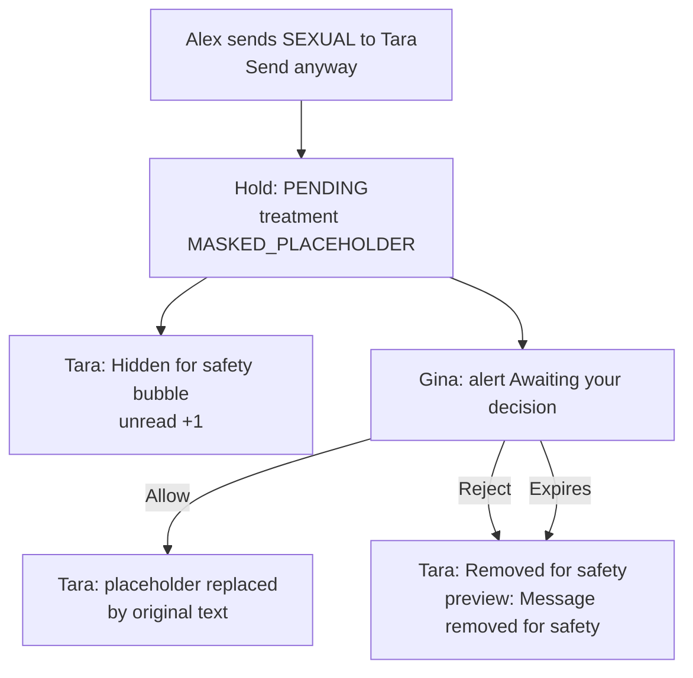

| ID | Pre | Steps | Expected | Auto |
| --- | --- | --- | --- | --- |
| TC-S3-01 | Alex → Tara thread | Send `SEXUAL`, Send anyway | Alex sees "Pending review" | INT end-to-end send |
| TC-S3-02 | TC-S3-01 done | Log in as Tara; open the thread | "Hidden for safety" bubble with the placeholder text; preview "Message hidden by safety filter"; unread 1; raw text absent from the API response | INT adult → Mature Teens |
| TC-S3-03 | TC-S3-01 done | Gina clicks **Allow** → Deliver message; Tara reopens thread | Original text shown in place of the placeholder; no second unread | — |
| TC-S3-04 | New hold as TC-S3-01 | Gina clicks **Reject** → Reject; Tara reopens | "Removed for safety" bubble; preview "Message removed for safety"; Alex's bubble shows "Not delivered" | INT adult → Mature Teens |

---

### S4 — Guardian reviews a held message

#### US-DM-05 — See a clear, safe alert

**As a** guardian  
**I want** an alert that tells me who tried to message my child and what happened  
**So that** I can decide without reading the content unless I choose to.

**Acceptance criteria**

- Card shows: priority, "Direct message", child name with age-zone badge, "From {name} {@handle}" with an **Adult account** chip when the sender is 18+, "Sexual content concern", the line "{Sender} tried to send {Child} a direct message flagged as sexual in nature.", the action taken, time and status.
- Actions for a pending decision: **View message**, **Allow**, **Reject**, **Block {name}**, **Report**, **Review DM settings** (when the child has a thread), **Message {child}**.
- Pending decisions are pinned above all other alerts, even if older than the 50 most recent alerts.

#### US-DM-06 — View the flagged message safely

**As a** guardian  
**I want to** optionally see what was sent, with explicit parts hidden  
**So that** I can make an informed decision without being exposed to the full content.

**Acceptance criteria**

- **View message** opens an interstitial: "View flagged message?" — "This message was flagged as sexual. Explicit words and contact details are partly hidden." with **Show message** / **Cancel**.
- **Show message** displays the category and light-masked text (e.g. "you look s***, send n**** to my number [phone hidden]").
- Each view writes a `CONTENT_VIEWED` audit and appears in Activity as "Flagged message viewed".
- Closing the dialog discards the text from the page. Escape closes the dialog.
- If the body has been purged: "This message is no longer available."

#### US-DM-07 — Allow or reject

**As a** guardian  
**I want to** deliver or reject the held message  
**So that** my child only receives what I'm comfortable with.

**Acceptance criteria**

- **Allow** asks "Deliver this message to {child}?" — "{child} will receive the original message from {sender}." For Kids, also "{sender} will be added to {child}'s Approved friends & adults circle."
- **Reject** asks "Reject this message?" — "It will never be delivered to {child}."
- After a decision the card shows "Allowed — delivered" / "Rejected — not delivered", the action-taken line updates, Allow/Reject disappear, and the nav badge decreases.
- Allow voids the sender's strike for that message (an already-applied restriction stays).
- If a co-guardian already decided, a notice explains what happened ("Another guardian already allowed this message.") and the card refreshes.

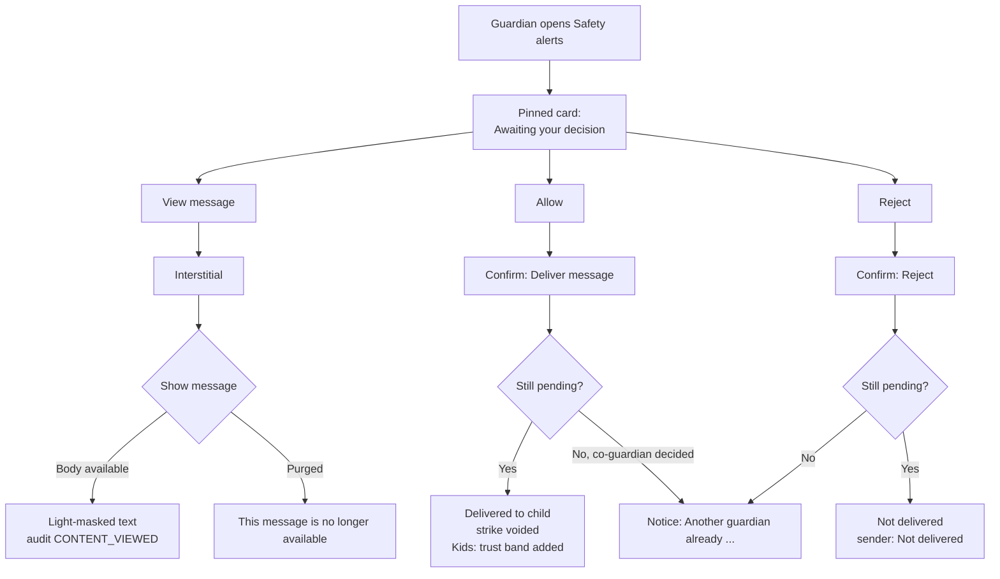

| ID | Pre | Steps | Expected | Auto |
| --- | --- | --- | --- | --- |
| TC-S4-01 | Pending hold Alex → Kiki (`SEXUAL_CONTACT`) | Gina opens Safety alerts | Card content and actions as in US-DM-05; "Adult account" chip; no "Review DM settings" (Kiki has no thread yet) | — |
| TC-S4-02 | TC-S4-01 | View message → Show message | Light-masked text: "s***", "n****", "[phone hidden]"; category "Sexual content concern" | INT view |
| TC-S4-03 | TC-S4-02 | Press Escape | Dialog closes; text no longer in the page | — |
| TC-S4-04 | TC-S4-02 | Open Activity | "Flagged message viewed — You viewed the flagged message." | INT report + block |
| TC-S4-05 | TC-S4-01 | Allow → Deliver message | Card "Allowed — delivered", "The message was delivered to Kiki after review."; badge −1; Kiki receives the original; Alex's "Pending review" cleared; strike `voidReason = guardian_allowed`; Alex added to Kiki's Approved friends & adults | INT adult → Kids hold |
| TC-S4-06 | TC-S4-05 | Grant opens his card and clicks Reject | Notice "Another guardian already allowed this message."; card shows Allowed | INT adult → Kids hold |
| TC-S4-07 | New pending hold | Gina and Grant click Allow/Reject at the same moment (two browsers) | Exactly one succeeds; the other sees the "already …" notice | INT concurrent decisions |
| TC-S4-08 | New pending hold | Sam (unlinked guardian) calls `PATCH /api/family-circle/alerts/{id}` and `POST …/view` with Gina's alert id | 404 for both | INT view; INT acknowledge |
| TC-S4-09 | Pending hold with a purged body | View message → Show message | "This message is no longer available." (HTTP 410) | INT view |
| TC-S4-10 | 51+ resolved alerts newer than one pending decision | Open Safety alerts | The older pending decision is still listed, at the top | INT pending pinned |

---

### S5 — Hold expiry and data retention

#### US-DM-08 — Undecided messages don't wait forever

**As a** platform  
**I want** held messages to expire after 7 days without a decision  
**So that** senders get a final outcome and children never receive stale flagged content.

**Acceptance criteria**

- A PENDING hold whose 7 days have passed becomes **EXPIRED**: never delivered.
- Sender sees "Not delivered"; Mature Teens placeholder becomes "Removed for safety".
- Alerts show "Expired — not delivered" and "No decision was made within 7 days, so the message was not delivered to {child}."
- Expiry happens nightly (cron at 03:00 UTC) **and** lazily whenever a participant or their guardian loads messages or alerts.
- Held bodies are purged 30 days after Allow and 90 days after Reject/Expiry (kept while a report is open).

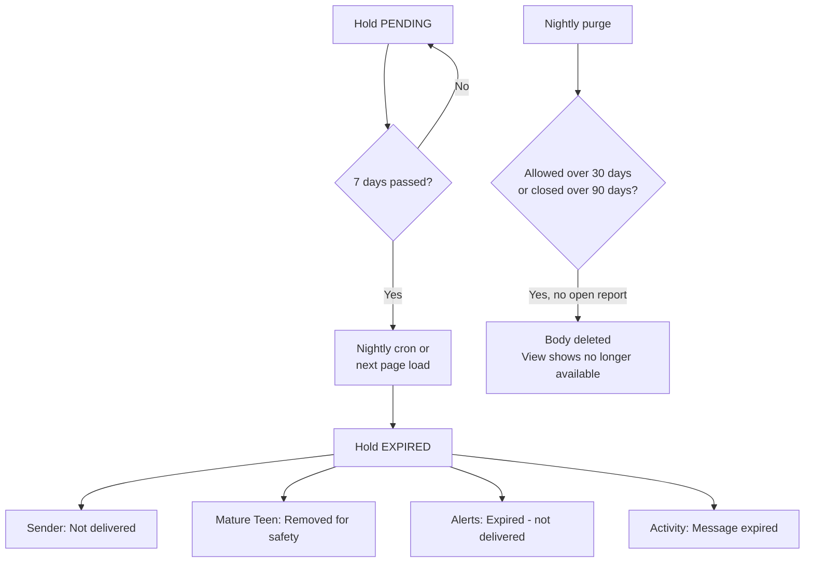

| ID | Pre | Steps | Expected | Auto |
| --- | --- | --- | --- | --- |
| TC-S5-01 | Pending hold Alex → Kiki; set `expiresAt` to the past | Gina opens Safety alerts | Card "Expired — not delivered" with the expiry copy; badge cleared; Alex sees "Not delivered" | INT overdue hold |
| TC-S5-02 | Pending hold Alex → Tara; `expiresAt` in the past | Tara opens Messages | Bubble "Removed for safety" | — |
| TC-S5-03 | CRON_SECRET set | `GET /api/cron/expire-dm-holds` without auth | 401 | — |
| TC-S5-04 | CRON_SECRET unset (local) | Same call | 503 "CRON_SECRET is not configured." | — |
| TC-S5-05 | Overdue hold exists | Call with `Authorization: Bearer <CRON_SECRET>` | 200 `{ ok: true, expired: ≥1, allowedPurged, closedPurged }` | — |
| TC-S5-06 | Allowed hold with `decidedAt` 31 days ago | Run cron, then guardian clicks View message | Body purged; "This message is no longer available." | — |
| TC-S5-07 | Rejected hold 91 days old **with an OPEN report** | Run cron | Body **not** purged | — |

---

### S6 — Guardian blocks or reports the sender

#### US-DM-09 — Block the sender

**As a** guardian  
**I want to** block the person who sent the flagged message  
**So that** they can't message my child again.

**Acceptance criteria**

- **Block {name}** asks "Block {name}?" — "{name} won't be able to send direct messages to {child}. You can change this later in DM settings."
- Works for pending and resolved alerts, including withheld holds where the child has no thread yet (a silent thread is created, with no message and no unread).
- The sender's composer to that child is replaced by "Direct messaging with this contact is restricted by a guardian."
- Activity: "Contact blocked — You blocked {name}."

#### US-DM-10 — Report the sender

**As a** guardian  
**I want to** report the sender to InrCliq  
**So that** the safety team can act.

**Acceptance criteria**

- Reasons: Sexual content, Grooming concern, Harassment, Something else. Details optional, max 1000 characters.
- Submitting without a reason shows "Choose a reason for the report."; picking a reason clears the error.
- Success: "Report submitted — Thanks — our safety team will review this."; the button changes to "Reported".
- One report per guardian per alert; repeats return the existing report.
- Kids/Teens + Sexual content or Grooming concern is flagged as a mandatory-report candidate and marked urgent.
- Activity: "Reported to INRCLIQ — You reported {name}."

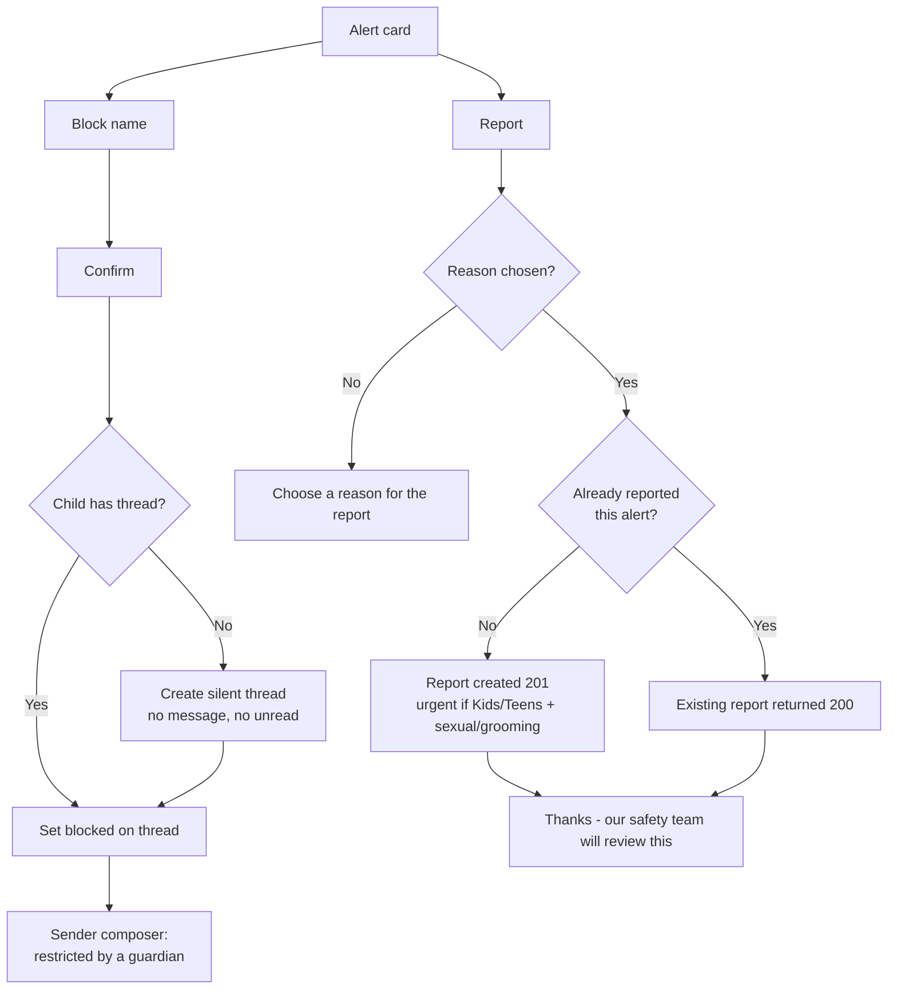

| ID | Pre | Steps | Expected | Auto |
| --- | --- | --- | --- | --- |
| TC-S6-01 | Pending withheld hold Alex → Kiki | Gina: Block Alex → confirm | Button "Blocked"; Kiki's message count and unread unchanged; Alex's composer to Kiki shows the guardian-restriction message | INT report + block |
| TC-S6-02 | Rejected hold Alex → Tara | Gina: Block Alex | Same as above for Tara; Activity "Contact blocked" | — |
| TC-S6-03 | Any hold alert | Report → Submit with no reason | "Choose a reason for the report."; selecting a reason clears it | — |
| TC-S6-04 | Any hold alert (Kiki) | Report → Grooming concern + details → Submit | Success copy; button "Reported"; DB report `priority = urgent`, `mandatoryReportCandidate = true` | INT report + block |
| TC-S6-05 | TC-S6-04 | Submit again via API with another reason | 200 `alreadyReported: true`; no second report | INT report + block |
| TC-S6-06 | Alert for Tara (Mature Teens) | Report → Harassment | Report `priority = normal`, not a mandatory candidate | — |
| TC-S6-07 | — | POST report with 1001-character details | 400 "Details must be 1000 characters or fewer." | — |

---

### S7 — Minor sends a sexual message to another monitored minor

#### US-DM-11 — Peer messages are reviewed without punishing the child

**As a** guardian of a child who sent a flagged message  
**I want to** be informed  
**So that** I can talk to my child, while the recipient's guardians decide on delivery.

**Acceptance criteria**

- The same hold applies as for adults (withheld for Kids/Teens, placeholder for Mature Teens).
- The minor sender never receives a strike or a restriction.
- The **recipient's** guardians get the decision alert.
- The **sender's** guardians get an informational alert: "{child} tried to send a message that was flagged. It was held for a safety review instead of being delivered." with **Acknowledge** (no Allow/Reject).
- A guardian linked to both children receives only the decision alert.
- Priority is High when the sender is Teens/Mature Teens and the recipient is Kids, or the age gap is ≥ 3 years, or severity ≥ 4; otherwise Medium.

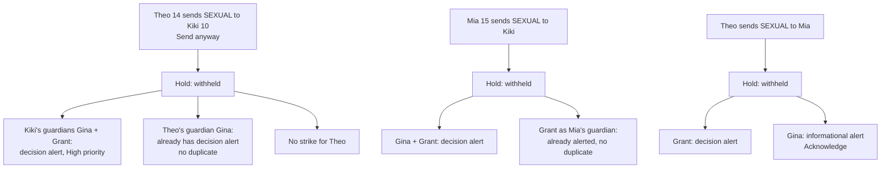

| ID | Pre | Steps | Expected | Auto |
| --- | --- | --- | --- | --- |
| TC-S7-01 | Theo → Mia thread | Theo sends `SEXUAL`, Send anyway | Theo sees "Pending review" and **no** strike notice; Mia sees nothing | INT acknowledge |
| TC-S7-02 | TC-S7-01 | Grant opens Safety alerts | Decision card for Mia (Allow/Reject); counterpart has no "Adult account" chip | — |
| TC-S7-03 | TC-S7-01 | Gina opens Safety alerts | Informational card for Theo with the held-for-review copy and **Acknowledge** only | INT acknowledge |
| TC-S7-04 | TC-S7-03 | Gina clicks Acknowledge | Status "Acknowledged"; badge −1; Allow on that alert via API returns 409 `INVALID_ALERT_STATE` | INT acknowledge |
| TC-S7-05 | Theo → Kiki | Theo sends `SEXUAL`, Send anyway | Gina receives **one** alert (decision for Kiki), not an extra informational one | — |
| TC-S7-06 | TC-S7-01 | Check DB | No `SenderSafetyStrike` for Theo | UNIT (minors never strike) |

---

### S8 — Masked delivery: adult recipients and non-sexual flags

#### US-DM-12 — Adult-to-adult and non-sexual flags keep today's behaviour

**As a** sender  
**I want** flagged messages to adults, and non-sexual flagged messages to minors, to still be deliverable in masked form  
**So that** conversations continue while protecting the reader.

**Acceptance criteria**

- **Adult recipient (R4):** warning shows the moderation title/message plus "Flagged as {category} (severity n/6)", with Edit message / Send anyway. Send anyway delivers a masked copy: label "Hidden by safety filter", text "This message was hidden because it didn't pass InrCliq's safety check." No hold, no strike.
- When a minor with guardians sends a flagged message to an adult, the minor's guardians get an informational alert.
- **Minor recipient, non-sexual category (R5):** warning uses the minor copy; Send anyway delivers masked; recipient's guardians get a Medium priority alert to acknowledge.
- The raw text is never stored on the recipient side.

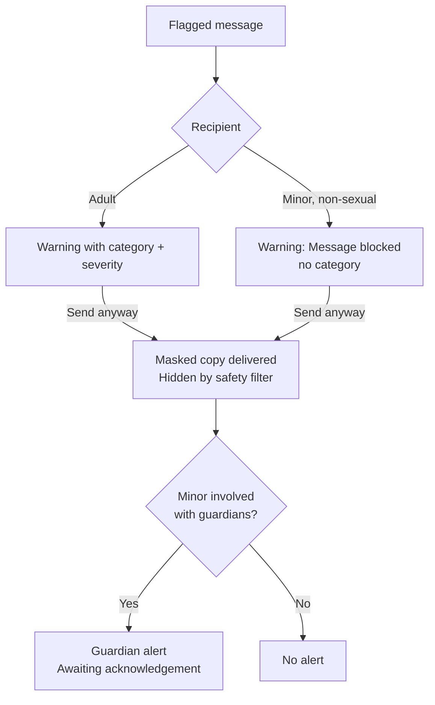

| ID | Pre | Steps | Expected | Auto |
| --- | --- | --- | --- | --- |
| TC-S8-01 | Ben → Alex | Send `SEXUAL` | Warning with "Flagged as sexual (severity 2/6)", Edit message + Send anyway | INT adult → adult |
| TC-S8-02 | TC-S8-01 | Send anyway; log in as Alex | Masked bubble "Hidden by safety filter" with the masked text; no hold; no strike for Ben | INT adult → adult |
| TC-S8-03 | Theo → Alex | Theo sends `SEXUAL`, Send anyway | Alex sees masked copy; Gina gets an informational alert "Theo sent a message that was flagged. The recipient saw a masked version." | UNIT R4 guardians |
| TC-S8-04 | Ben → Tara | Send `HARASS`, Send anyway | Minor warning copy (no category); Tara sees masked copy; Gina gets a Medium priority alert with Acknowledge | UNIT R5 |

---

### S9 — Sexual message to an unmonitored child

#### US-DM-13 — Children without a guardian are protected by default

**As a** platform  
**I want** sexual messages to unmonitored children to be impossible to override  
**So that** no one can reach a child who has nobody to review messages for them.

**Acceptance criteria**

- Warning "Message blocked" with the extra line "This message can't be sent to this account." and only **Edit message** (no Send anyway).
- A crafted request with `acceptModeration: true` is still rejected (422); nothing is held or delivered and no thread is created for the child.
- If an adult sends severity 6 content and still tries to send, an urgent system report is filed. Repeat attempts within 24 hours reuse the same open report.

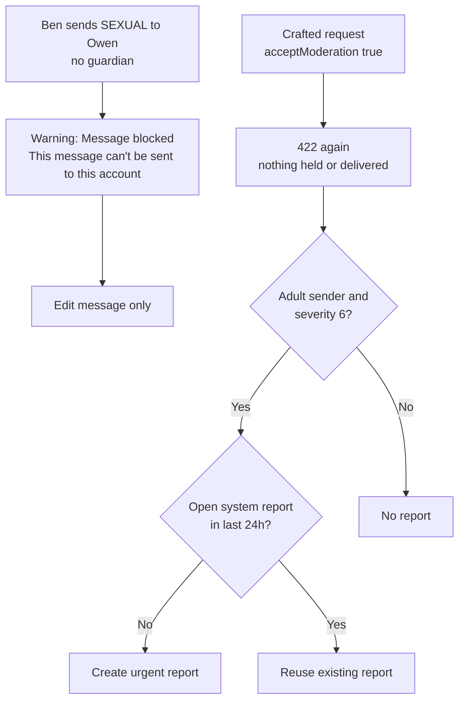

| ID | Pre | Steps | Expected | Auto |
| --- | --- | --- | --- | --- |
| TC-S9-01 | Ben → Owen | Send `SEXUAL` | Warning with "This message can't be sent to this account."; only Edit message | INT unmonitored child |
| TC-S9-02 | TC-S9-01 | POST the same body with `acceptModeration: true` | 422; `canSendAnyway: false`; no hold; Owen has no thread | INT unmonitored child |
| TC-S9-03 | Severity-6 text (safe test environment only) | Ben tries Send anyway twice via API | One urgent `sexual_content_to_minor` system report, reused on the second attempt | INT unmonitored child (dedupe) |

---

### S10 — Moderation check fails

#### US-DM-14 — No unchecked messages reach a minor

**As a** platform  
**I want** messages to minors to be blocked when the safety check can't run  
**So that** outages never let unchecked content through.

**Acceptance criteria**

- Minor recipient: "Message not sent" — "We couldn't run our safety check on this message. Please try again." with **Try again** only.
- Adult recipient: the verification warning allows Send anyway (masked delivery, R4).

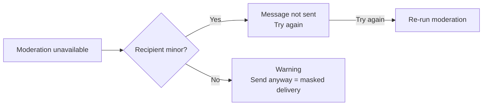

| ID | Pre | Steps | Expected | Auto |
| --- | --- | --- | --- | --- |
| TC-S10-01 | Local env with `CONTENT_SAFETY_KEY` removed | Alex sends `CLEAN` to Kiki | "Message not sent" + "Try again"; nothing saved | UNIT R3 |
| TC-S10-02 | Same env | Alex sends `CLEAN` to Ben | "Unable to verify message" warning with Send anyway; Send anyway delivers masked | UNIT R4 |
| TC-S10-03 | TC-S10-01; restore the key | Click Try again | Message delivered normally | — |

---

### S11 — Sender enforcement: strikes and restrictions

#### US-DM-15 — Repeat offenders lose access to minors

**As a** platform  
**I want** adults who repeatedly push flagged sexual messages to minors to be restricted  
**So that** children are protected from persistent bad actors.

**Acceptance criteria**

| Non-voided strikes in 30 days | Result | Sender sees |
| --- | --- | --- |
| 1 | Warning | Notice "Messages to accounts under 18 are reviewed for safety. More flagged messages may stop you messaging under-18 accounts." |
| 2 | 7-day minors-only restriction | Notice "You can't message accounts under 18 until {date} because of repeated safety flags." |
| 3+ | Indefinite restriction pending review + urgent `repeat_offender` report | Notice "Your ability to message accounts under 18 is paused while our team reviews your account." |

- While restricted, every thread with a minor shows the restriction text in place of the composer — including after a page reload. Sending returns 403 `DM_MINOR_RESTRICTED`.
- Messaging adults is unaffected.
- A guardian Allow voids that strike but does not lift a restriction already applied.
- Strikes, restrictions and reviews never appear in the guardian's Activity.

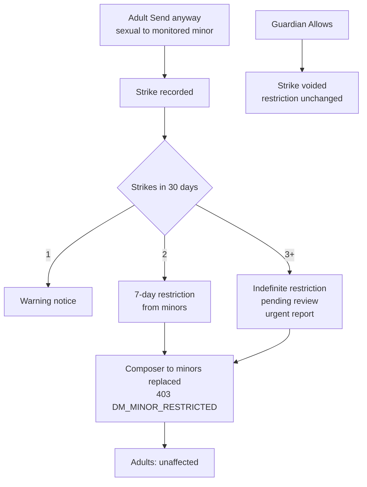

| ID | Pre | Steps | Expected | Auto |
| --- | --- | --- | --- | --- |
| TC-S11-01 | Ben has no strikes | Ben sends `SEXUAL` to Kiki, Send anyway | Warning-level notice | INT strike escalation |
| TC-S11-02 | TC-S11-01 | Ben sends `SEXUAL` to Tara, Send anyway | Restricted notice with a date 7 days out | INT strike escalation |
| TC-S11-03 | TC-S11-02 | Reload `/feed/messages`, open the Kiki thread | Composer replaced by the restriction text (no Send button) | — |
| TC-S11-04 | TC-S11-02 | Send `CLEAN` to Kiki via API | 403 `DM_MINOR_RESTRICTED` with `restrictionEndsAt` | INT strike escalation |
| TC-S11-05 | TC-S11-02 | Ben sends `CLEAN` to Alex | Delivered normally | INT strike escalation |
| TC-S11-06 | Set Ben's restriction `endsAt` to the past; 2 strikes still in window | Ben sends `SEXUAL` to Kiki, Send anyway | "Paused while our team reviews" notice; restriction `endsAt = null`, `PENDING_REVIEW`; urgent `repeat_offender` report | INT strike escalation |
| TC-S11-07 | Pending hold from Ben with a strike | Gina allows | Strike voided; existing restriction still active | INT adult → Kids hold |
| TC-S11-08 | TC-S11-02 | Gina opens Activity | No entries mentioning strikes or restrictions | INT report + block |

---

### S12 — Guardian messages their own linked child

#### US-DM-16 — Parents aren't punished or asked to review themselves

**As a** guardian messaging my own child  
**I want** a false positive not to restrict me, and not to be asked to approve my own message  
**So that** safety checks stay fair while my child is still protected.

**Acceptance criteria**

- The guardian sees the same "Message blocked" warning.
- **Co-guardian exists:** Send anyway holds the message; **only the co-guardian** gets the decision alert; the sender gets no alert and no strike; the sender cannot allow/reject it (404).
- **Sender is the only guardian:** the child counts as unmonitored — no Send anyway, no strike. Severity 6 still files an urgent report.
- A guardian already restricted from minors stays restricted, including for their own child.

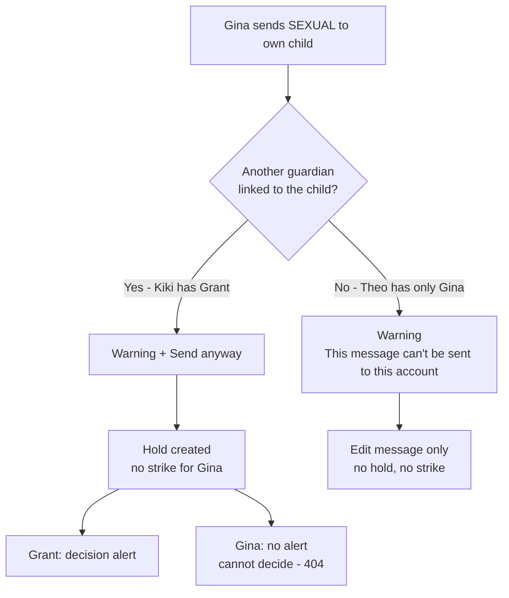

| ID | Pre | Steps | Expected | Auto |
| --- | --- | --- | --- | --- |
| TC-S12-01 | Gina → Kiki thread | Gina sends `SEXUAL`, Send anyway | "Pending review"; no strike notice; no strike in DB | INT guardian → own child |
| TC-S12-02 | TC-S12-01 | Grant opens Safety alerts | Decision card for Kiki from Gina with Allow/Reject | INT guardian → own child |
| TC-S12-03 | TC-S12-01 | Gina opens Safety alerts | No alert for her own message | INT guardian → own child |
| TC-S12-04 | TC-S12-01 | Gina calls `PATCH` allow on Grant's alert id | 404 | INT guardian → own child |
| TC-S12-05 | Gina → Theo thread (Gina is Theo's only guardian) | Send `SEXUAL` | Warning with "This message can't be sent to this account."; only Edit message; crafted Send anyway returns 422; no hold, no strike | INT sole guardian |

---

### S13 — Guardian dashboard: badges, overview and activity

#### US-DM-17 — Know at a glance what needs attention

**As a** guardian  
**I want** unresolved alerts counted and the most urgent one surfaced  
**So that** I act quickly on held messages.

**Acceptance criteria**

- Nav item "Safety alerts" shows the number of alerts awaiting a decision or acknowledgement; it refreshes every 30 seconds and after any action.
- Overview shows the top alert (a pending decision if there is one).
- Resolved cards remain visible, greyed, with Block/Report still available; "Message {child}" is shown only while unresolved.
- Activity lists safety events newest first in plain language: Safety alert raised, Flagged message viewed, Safety alert acknowledged, Message allowed, Message rejected, Message expired, Contact blocked, DM settings changed, Reported to INRCLIQ, Added to Safe Contact Circle.
- Activity never includes message text, strikes, restrictions or system reports.

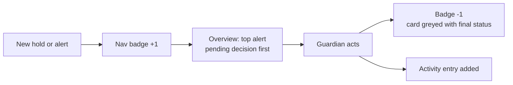

| ID | Pre | Steps | Expected | Auto |
| --- | --- | --- | --- | --- |
| TC-S13-01 | Two pending holds for Gina's children | Open Family Circle | Badge "2 new"; Overview shows a pending decision | INT adult → Kids hold (count) |
| TC-S13-02 | TC-S13-01 | Reject one | Badge becomes 1 without reload | — |
| TC-S13-03 | After TC-S4, S6 flows | Open Activity | Entries for viewed, allowed, rejected, blocked, reported, trust band added — no message text | INT report + block |
| TC-S13-04 | Resolved alert | Inspect card | Greyed; final status; Block and Report visible; no Allow/Reject; no "Message {child}" | — |

---

## 7. Hold lifecycle (reference)

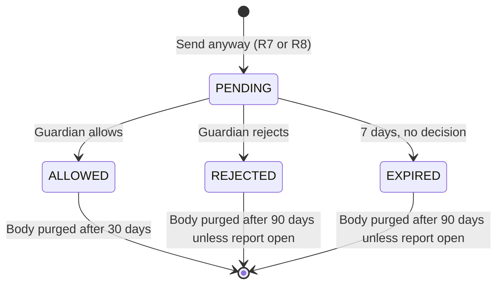

---

## 8. Traceability

| Story | Scenario | Test cases |
| --- | --- | --- |
| US-DM-01 Send a normal message | S1 | TC-S1-01 – 02 |
| US-DM-02 Be warned before sending to a minor | S2 | TC-S2-01 – 03 |
| US-DM-03 Send anyway puts the message on hold | S2 | TC-S2-04 – 08 |
| US-DM-04 Mature teen placeholder | S3 | TC-S3-01 – 04 |
| US-DM-05 Safe alert card | S4 | TC-S4-01, TC-S4-10 |
| US-DM-06 View flagged message safely | S4 | TC-S4-02 – 04, TC-S4-08 – 09 |
| US-DM-07 Allow or reject | S4 | TC-S4-05 – 07 |
| US-DM-08 Expiry and retention | S5 | TC-S5-01 – 07 |
| US-DM-09 Block the sender | S6 | TC-S6-01 – 02 |
| US-DM-10 Report the sender | S6 | TC-S6-03 – 07 |
| US-DM-11 Peer minor messages | S7 | TC-S7-01 – 06 |
| US-DM-12 Masked delivery | S8 | TC-S8-01 – 04 |
| US-DM-13 Unmonitored child | S9 | TC-S9-01 – 03 |
| US-DM-14 Moderation check fails | S10 | TC-S10-01 – 03 |
| US-DM-15 Strikes and restrictions | S11 | TC-S11-01 – 08 |
| US-DM-16 Guardian messaging own child | S12 | TC-S12-01 – 05 |
| US-DM-17 Dashboard, badges, activity | S13 | TC-S13-01 – 04 |

---

## 9. Running the automated tests

```bash
# Policy + light mask (no database)
npx tsx --test tests/dm-safety-policy.test.ts tests/light-mask.test.ts

# Integration (local database + Azure Content Safety; creates and deletes *@dm-review.test users)
npx tsx --env-file=.env --env-file=.env.local --test tests/dm-guardian-review.integration.test.ts
```

---

## 10. Related code entry points

| Area | File |
| --- | --- |
| Policy rules R1–R8 | `src/lib/guardian/dm-safety-policy.ts` |
| Send flow | `src/lib/feed/chat-service.ts` (`sendChatMessage`) |
| Holds, decisions, expiry, purge | `src/lib/guardian/dm-moderation-hold.ts` |
| Strikes and restrictions | `src/lib/guardian/sender-enforcement.ts` |
| Alerts, view, block, report, activity | `src/lib/guardian/safety-alerts.ts` |
| Light mask | `src/lib/moderation/light-mask.ts` |
| Sender and recipient UI | `src/components/feed/messages/MessagesView.tsx` |
| Guardian UI | `src/components/guardian/family-center/FamilyCenterPanels.tsx`, `SafetyAlertDecisionActions.tsx`, `SafetyAlertContentViewer.tsx`, `SafetyAlertReportDialog.tsx` |
| Nightly cron | `src/app/api/cron/expire-dm-holds/route.ts` (`vercel.json`, 03:00 UTC) |
