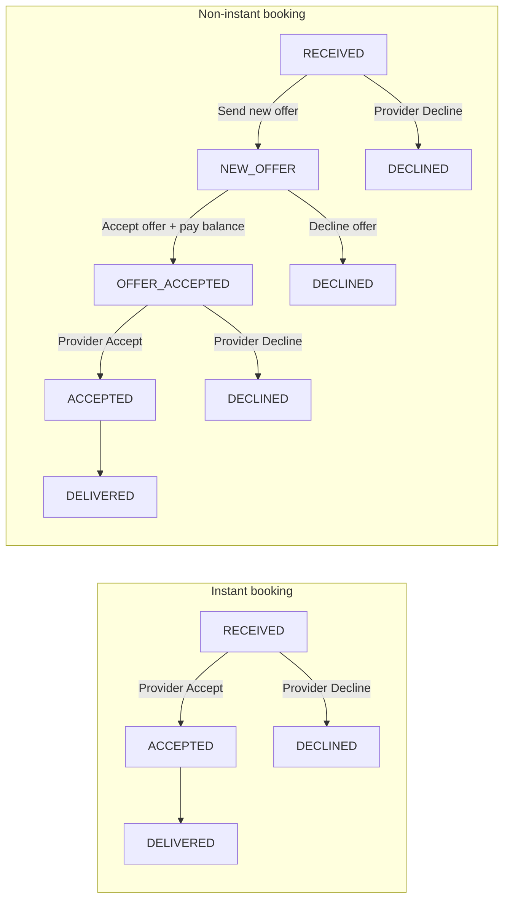

# Service Requests — User Stories & Acceptance Criteria

| Document | `us-service-requests.md` |
| --- | --- |
| Module | Service Requests (Special Requests / Bookings) |
| Based on | Current product implementation in `src/` (as of 2026-08-24) |
| Actors | Requester (fan), Provider (verified creator), Guest, Platform admin |
| Primary surfaces | Feed Calendar, Profile Special Requests, Messages, Seller Tools, Settings Bookings |

---

## 1. Purpose

This specification captures **user stories and acceptance criteria** for the Service Requests module as implemented today: fans request personalized services from creators; verified creators manage offerings, accept/decline work, complete or deliver work, and both parties can leave experience feedback after completion.

Stories reflect **current behaviour**. Known gaps and placeholders are listed in [§7 Out of scope / known gaps](#7-out-of-scope--known-gaps-relative-to-current-code).

---

## 2. Actors

| Actor | Description |
| --- | --- |
| **Requester** | Authenticated user who books a special request from a creator (`SpecialRequest.userId`). Uses **My Requests** and Billboard (own items). |
| **Provider** | Authenticated user who owns a **verified** creator profile and receives inbound requests (`creator.userId`). Uses **Commitments**, Seller Service Requests, and completion / delivery tools. |
| **Guest** | Unauthenticated visitor. May browse public Special Requests catalog when live; cannot create bookings. |
| **Platform admin** | Operator using Settings → Bookings to list/search and accept/decline/delete bookings across creators. |

---

## 3. Status lifecycle (current)

| Status | Requester label | Provider label | Typical meaning |
| --- | --- | --- | --- |
| `RECEIVED` | Requested | Received | Created; awaiting provider decision |
| `NEW_OFFER` | New offer | New offer | Provider sent a counter-offer on a **non-instant** request; awaiting requester response |
| `OFFER_ACCEPTED` | Awaiting acceptance | Awaiting acceptance | Requester accepted the offer and paid the balance; awaiting provider final accept |
| `ACCEPTED` | Accepted | Accepted | Provider accepted; delivery countdown applies |
| `IN_PROGRESS` | In Progress | In Progress | Supported in UI/API; not actively transitioned by current flows |
| `DELIVERED` | Delivered | Delivered | Provider completed the request (with or without a file, depending on instant flag) |
| `DECLINED` | Declined | Declined | Declined by provider or requester (with reason where required) |
| `CANCELLED` | Cancelled | Cancelled | Present in schema; not set by current Service Requests flows |

**Implemented transitions — instant bookings**

1. Create → `RECEIVED`
2. `RECEIVED` → `ACCEPTED` (provider **Accept**)
3. `RECEIVED` → `DECLINED` (provider **Decline** + reason)
4. `ACCEPTED` or `IN_PROGRESS` → `DELIVERED` (provider **Deliver** or **Mark as completed**)

**Implemented transitions — non-instant bookings**

1. Create → `RECEIVED` (requester pays **booking fee** / 5% deposit at checkout)
2. `RECEIVED` → `NEW_OFFER` (provider **Send new offer**, optional price + note) **or** `DECLINED` (provider decline + reason)
3. `NEW_OFFER` → `OFFER_ACCEPTED` (requester **Accept offer** and pay balance) **or** `DECLINED` (requester **Decline offer**)
4. `OFFER_ACCEPTED` → `ACCEPTED` (provider **Accept** — starts delivery countdown) **or** `DECLINED` (provider decline + reason)
5. `ACCEPTED` or `IN_PROGRESS` → `DELIVERED` (provider **Mark as completed**)

Provider **Accept** from `RECEIVED` is **not** available for non-instant bookings; the provider must **Send new offer** first.

**Instant vs non-instant completion labels**

| Flag | Primary CTA | Delivery file | Success toast (typical) |
| --- | --- | --- | --- |
| Instant (`instantBooking: true`) | **Deliver** | **Required** | Marked as delivered |
| Non-instant | **Mark as completed** | **Optional** | Marked as completed |

---

## 4. Navigation & entry points

| Surface | Route / entry | Who |
| --- | --- | --- |
| Feed nav **Calendar** | `/feed/bookings` | Requester, Provider |
| Tab **Billboard** | `?tab=calendar` | Both |
| Tab **My Requests** | `?tab=outbound` | Requester |
| Tab **Commitments** | `?tab=inbound` | Provider (verified only) |
| Complete / deliver page | `/feed/bookings/[id]/deliver` | Provider |
| Balance checkout (non-instant offer) | `/feed/bookings/[id]/balance` | Requester |
| Profile **Special Requests** | `/feed/profile/[slug]/requests` | Guest browse; Requester book |
| Request choose / checkout | `/requests`, `/requests/choose`, `/requests/checkout` | Requester |
| Messages | `/feed/messages` (booking deep links) | Both |
| Seller Tools **Service requests** | `/seller/service-requests` | Provider |
| Settings **Bookings** | `/settings/bookings` | Platform admin |

---

## 5. Epics & user stories

### Epic A — Discover & configure offerings

#### US-SR-A01 — Browse a creator’s Special Requests catalog (Guest / Requester)

**As a** guest or requester  
**I want to** open a creator’s Special Requests page from their public profile  
**So that** I can see what personalized services they offer.

**Acceptance criteria**

1. When the creator’s Special Requests catalog is enabled and has public categories, the profile shows a Special Requests control that opens `/feed/profile/[slug]/requests`.
2. When the catalog is disabled or unavailable, the requester sees an unavailable state instead of a bookable catalog.
3. Guests can view live offerings but cannot complete a booking without signing in.
4. Catalog content reflects the creator’s configured categories, formats, pricing, and instant vs non-instant flags.

---

#### US-SR-A02 — Manage Service Requests catalog (Provider)

**As a** verified provider  
**I want to** configure Special Requests offerings in Seller Tools  
**So that** fans can book the right services at the right price.

**Acceptance criteria**

1. Verified providers can open Seller Tools → Service requests (and related Settings card).
2. Provider can manage offerings (categories/content), booking calendar / availability, and inbox of inbound requests.
3. Unverified creators do not get full inbound Commitments / seller booking APIs for Special Requests.
4. A verified creator without a catalog may receive a blank catalog provisioned for setup.
5. Provider can mark unavailable dates so those dates are blocked for booking.
6. Categories support an **instant booking** flag that drives checkout fees and later Deliver vs Mark as completed behaviour.

---

### Epic B — Create a service request (Requester)

#### US-SR-B01 — Start a booking from Special Requests

**As a** requester  
**I want to** choose a service and personalize my request  
**So that** the provider knows what to deliver.

**Acceptance criteria**

1. Authenticated requester can progress from Special Requests → choose → checkout.
2. Checkout captures service details appropriate to the offering, including as applicable: booking type/label, category, occasion, formats/content type, duration/format details, tone, delivery method, recipient (and username if required), shoutout message, special instructions.
3. Appearance-style offerings capture location, expectation, reference, and duration where applicable.
4. Fees shown include day/feed/total amounts and currency as configured.
5. Request date / deliver-by timing is captured and stored on the booking.
6. Unauthenticated attempts to create a booking via API are rejected (401).

---

#### US-SR-B02 — Instant vs non-instant booking terms

**As a** requester  
**I want to** understand whether I am paying a booking fee or the full amount now  
**So that** I know what I owe at checkout.

**Acceptance criteria**

1. If the category is **instant booking**, checkout presents charging the **full total** now (per current UI rules).
2. If the category is **non-instant**, checkout presents a **booking fee** (5% of total) due now and requires acceptance of fee/terms where shown.
3. The `instantBooking` flag is stored on the created request for later accept and completion UX.
4. Creating a request always starts in status `RECEIVED` (including instant bookings — no auto-accept in current implementation).
5. For **non-instant** bookings, the remaining balance (total minus deposit) is due later via balance checkout after the requester accepts a provider’s new offer.

---

#### US-SR-B03 — Submit booking and confirmation in Messages

**As a** requester  
**I want to** complete checkout and receive a confirmation in Messages  
**So that** I have a record of my request.

**Acceptance criteria**

1. Successful submit creates a `SpecialRequest` with a unique reference and status `RECEIVED`.
2. A booking confirmation message is posted to **both** the requester’s and provider’s conversation inboxes.
3. Confirmation card shows key facts including **Deliver by** (stable locale formatting for SSR/client).
4. Requester can open the related booking from Messages into Calendar with the correct context (booking/ref/tab).
5. Payment UI may be simulated (no live PSP required for current build); submit still persists the booking and chat confirmation.

---

#### US-SR-B04 — Respect provider availability

**As a** requester  
**I want** booking blocked on dates the provider cannot take  
**So that** I do not request an unavailable slot.

**Acceptance criteria**

1. Dates marked unavailable by the provider cannot be booked.
2. Dates occupied by blocking booking statuses (`RECEIVED`, `ACCEPTED`, `IN_PROGRESS`, `DELIVERED`) are treated as unavailable for new bookings per current calendar rules.

---

### Epic C — Calendar & list views (Requester & Provider)

#### US-SR-C01 — Use Calendar Billboard

**As a** requester or provider  
**I want** a month Billboard of my alerts, events, bookings, and requests by date  
**So that** I can see what is happening on each day.

**Acceptance criteria**

1. Feed nav **Calendar** opens `/feed/bookings` with Billboard as the default calendar tab.
2. Billboard supports filters such as **All / Commitments / My Requests**.
3. Selecting a day shows bookings for that date; empty days show a clear empty message (e.g. none for today/this day).
4. Day list items show **Deliver by** when available.
5. Selecting a booking opens booking details (drawer) without navigating to a profile by clicking the card container.

---

#### US-SR-C02 — View My Requests (Requester)

**As a** requester  
**I want** a list of outbound service requests  
**So that** I can track status and act on completed work.

**Acceptance criteria**

1. **My Requests** tab lists only outbound bookings for the signed-in user.
2. Each card shows request title, status, reference, counterpart identity (**not** linked to profile), and key facts including total, created date, **Deliver by** (when set), and content type.
3. For `NEW_OFFER`, requester sees **Accept offer** / **Decline offer** actions with explanatory copy.
4. For `OFFER_ACCEPTED`, requester sees status **Awaiting acceptance** (no countdown yet).
5. Card footer: **Feedback** or saved rating control on the **left** (when delivered); right-side actions **Messages** → **Details** (compact buttons with icons).
6. Empty state explains that paid special requests will appear here.

---

#### US-SR-C03 — View Commitments (Provider)

**As a** verified provider  
**I want** a list of inbound service requests  
**So that** I can accept, decline, complete, and message fans.

**Acceptance criteria**

1. **Commitments** is available only when the user is a verified creator; otherwise the tab is disabled with guidance to get verified.
2. List shows inbound bookings with status, reference, requester identity (**not** linked to profile), facts including **Deliver by**, and actions.
3. For **instant** `RECEIVED`, provider can **Accept** / **Decline** from the card or details drawer.
4. For **non-instant** `RECEIVED`, provider sees **Send new offer** / **Decline** (not direct Accept).
5. For `NEW_OFFER`, requester-side actions appear on **My Requests**; provider waits for requester response.
6. For `OFFER_ACCEPTED`, provider sees **Accept** / **Decline** copy explaining the requester paid the balance and final accept starts the countdown.
7. For `ACCEPTED` / `IN_PROGRESS`, provider sees delivery countdown with copy: **“You are committed to deliver in…”** and the completion CTA:
   - Instant → **Deliver**
   - Non-instant → **Mark as completed**
8. Action order on cards: Feedback/rating (left, when applicable); completion CTA (when applicable) → **Messages** → **Details** (right).
9. Empty state explains that incoming requests appear here.

---

#### US-SR-C04 — Open booking details drawer

**As a** requester or provider  
**I want** a details slide panel for a booking  
**So that** I can review the full service summary and take the next action.

**Acceptance criteria**

1. **Details** opens a slide panel with booking title, reference, status badge, and counterpart block (not linking to profile).
2. Panel shows service summary rows (type, category, formats, delivery, recipient, message, special instructions, total, and acceptance note/offer/attachment when present).
3. Panel shows timestamps: **Created**; **Deliver by** whenever a deadline exists (any status that has `deliverBy`); Accepted / Declined (+ reason) when applicable; pending offer details when stored.
4. Contextual actions appear by status and role:
   - Provider, instant `RECEIVED`: Accept / Decline
   - Provider, non-instant `RECEIVED`: Send new offer / Decline
   - Provider, `OFFER_ACCEPTED`: Accept / Decline (final accept)
   - Requester, `NEW_OFFER`: Accept offer / Decline offer
   - Provider: confirmation entry for **Deliver** / **Mark as completed** when `ACCEPTED` / `IN_PROGRESS`
   - Both: Give feedback / view rating; **Open messages** when a messages link exists
5. Closing the panel clears booking selection from the URL where used.

---

### Epic D — Accept, decline & counter-offer

#### US-SR-D01 — Accept an instant received request

**As a** provider  
**I want to** accept an inbound **instant** request  
**So that** I commit to deliver by the agreed time.

**Acceptance criteria**

1. Accept is available only for inbound **instant** bookings in `RECEIVED`.
2. Accept collects an optional note only (no offer price/attachment in feed accept UX for instant).
3. On success, status becomes `ACCEPTED`, `acceptedAt` is set, optional acceptance details are stored.
4. Status notes are posted to both parties’ message inboxes (and may show Deliver by + countdown when applicable).
5. UI updates status/labels without requiring a full page reload of the session list where optimistic/patch updates apply.
6. Seller Inbox may support accept/decline with a simpler payload (no offer/attachment) compared to Feed Commitments.

---

#### US-SR-D02 — Send a new offer (non-instant provider)

**As a** provider  
**I want to** respond to a non-instant request with a new offer instead of accepting outright  
**So that** I can confirm price and terms before committing.

**Acceptance criteria**

1. **Send new offer** is available only for inbound **non-instant** bookings in `RECEIVED`.
2. Instant bookings cannot send a new offer; provider must Accept or Decline instead.
3. Modal captures optional **new offer price** and optional **note to requester**; leaving price blank keeps the current total.
4. On success, status becomes `NEW_OFFER`, optional offer metadata is stored in `detailsJson.pendingOffer`, and `totalFee` updates when a new price is provided.
5. A **new offer** status note is posted to both parties’ inboxes (`kind: new_offer`).
6. Direct provider **Accept** from `RECEIVED` is rejected for non-instant bookings with guidance to send a new offer first.

---

#### US-SR-D03 — Accept offer and pay balance (non-instant requester)

**As a** requester  
**I want to** accept a provider’s new offer and pay the remaining balance  
**So that** the booking can proceed to final provider acceptance.

**Acceptance criteria**

1. **Accept offer** is available only for outbound bookings in `NEW_OFFER`.
2. Accepting opens balance checkout at `/feed/bookings/[id]/balance`, showing deposit already paid, balance due, and simulated payment UI.
3. Balance due equals total fee minus the initial booking deposit (5% paid at original checkout).
4. Successful payment calls `PATCH …/bookings/[id]` with `action: "pay_balance"`.
5. On success, status becomes `OFFER_ACCEPTED` (label **Awaiting acceptance**), balance payment metadata is stored in `detailsJson.balancePayment`, and an **offer accepted** note is posted to both inboxes.
6. Delivery countdown does **not** start at this step; provider must still accept.
7. Requester is redirected back to **My Requests** with a success toast after payment.

---

#### US-SR-D04 — Decline offer (non-instant requester)

**As a** requester  
**I want to** decline a provider’s new offer  
**So that** I am not bound to revised terms.

**Acceptance criteria**

1. **Decline offer** is available only for outbound bookings in `NEW_OFFER`.
2. Decline uses the offer-decline flow (`action: "decline_offer"`); reason defaults to “Offer declined.” if omitted.
3. On success, status becomes `DECLINED`, decline metadata is stored, and both parties receive an **offer declined** note in Messages.
4. A **refund issued** note is posted when the requester had paid a deposit (see US-SR-D07).

---

#### US-SR-D05 — Final accept after balance paid (non-instant provider)

**As a** provider  
**I want to** accept a booking after the requester paid the balance  
**So that** I confirm the engagement and the delivery countdown starts.

**Acceptance criteria**

1. Final **Accept** is available only for inbound **non-instant** bookings in `OFFER_ACCEPTED`.
2. Accept modal explains that the requester paid the balance and acceptance starts the countdown.
3. On success, status becomes `ACCEPTED`, `acceptedAt` is set, and an **accepted** status note is posted to both inboxes with countdown context.
4. Provider may still **Decline** from `OFFER_ACCEPTED` (see US-SR-D06).

---

#### US-SR-D06 — Decline a received or awaiting-acceptance request

**As a** provider  
**I want to** decline a request with a reason  
**So that** the requester understands why it will not proceed.

**Acceptance criteria**

1. Decline is available for inbound bookings in `RECEIVED` (instant or non-instant) or `OFFER_ACCEPTED` (after balance paid).
2. A decline reason is **required**; empty reason is rejected.
3. On success, status becomes `DECLINED`, decline metadata is stored, and both parties receive a decline note in Messages.
4. Details panel shows declined time and reason.
5. A **refund issued** note follows when applicable (see US-SR-D07).

---

#### US-SR-D07 — Refund notice on decline

**As a** requester  
**I want to** see a refund amount in Messages when a booking is declined  
**So that** I know what will be returned.

**Acceptance criteria**

1. After any decline that triggers a refund (`declineSettingsBooking`, `declineOfferByRequester`), a **refund issued** chat note is posted to both parties when the refund amount is greater than zero.
2. Refund amount rules (simulated; no live PSP):
   - **Instant** declined from `RECEIVED`: full total paid at checkout
   - **Non-instant** declined before balance payment (`RECEIVED`, `NEW_OFFER`): booking deposit only (5%)
   - **Non-instant** declined after balance payment (`OFFER_ACCEPTED`): deposit + balance paid
3. Refund metadata is stored on the booking in `detailsJson.refund` (amount, currency, `issuedAt`).
4. Refund note shows amount, currency, reference, and copy that funds return to the original payment method.
5. Message preview label: **Refund issued · [reference]**.

---

### Epic E — Delivery countdown & fulfillment (Provider & Requester)

#### US-SR-E01 — See delivery countdown and deliver-by date

**As a** requester or provider  
**I want** a live countdown after acceptance and a clear deliver-by datetime everywhere the booking appears  
**So that** I know the deadline.

**Acceptance criteria**

1. Countdown shows only when status is `ACCEPTED` or `IN_PROGRESS` and a `deliverBy` timestamp exists.
2. Countdown does **not** show for `OFFER_ACCEPTED` (**Awaiting acceptance**); the deadline starts only after provider final accept.
3. **Requester** copy: receive-oriented (“You will receive your delivery in…”).
4. **Provider** copy: commitment-oriented (“You are committed to deliver in…”).
5. Countdown appears on list cards (compact) and in the details drawer; accept notes in chat may also surface countdown context.
6. Human-readable **Deliver by** datetime appears on: list cards, details drawer, Billboard / seller day items, Seller Inbox column, booking confirmation cards, and status notes (when the deadline is known). Formatting uses a fixed locale so SSR and client match.

---

#### US-SR-E02 — Confirm and complete / deliver work

**As a** provider  
**I want to** confirm readiness and mark the request delivered or completed  
**So that** the requester’s request is fulfilled.

**Acceptance criteria**

1. Completion CTA is available for inbound `ACCEPTED` or `IN_PROGRESS` bookings from list and details.
2. Label depends on booking type:
   - Instant → **Deliver**
   - Non-instant → **Mark as completed**
3. Clicking the CTA opens a confirmation modal before navigation:
   - Instant: “Ready to complete this request?”
   - Non-instant: “Ready to mark this as completed?” (notes that a file is optional)
4. Confirm navigates to `/feed/bookings/[id]/deliver` with request review, file upload, optional note, and submit.
5. **File rules:**
   - Instant: delivery file is **required** (valid `/uploads/…` path); submit disabled until uploaded.
   - Non-instant: delivery file is **optional**; provider can mark completed with note only or with a file.
6. On success, status becomes `DELIVERED`, delivery metadata is stored (file may be null for non-instant), both parties get a completed/delivered note in Messages, and the provider returns to Calendar with a success toast (delivered vs completed wording).
7. Completion CTA is not available to the requester.

---

### Epic F — Feedback (Requester & Provider)

#### US-SR-F01 — Submit experience feedback after delivery

**As a** requester or provider  
**I want to** rate the experience after a request is delivered  
**So that** I can record how the engagement went.

**Acceptance criteria**

1. Feedback is available only when status is `DELIVERED`.
2. Both requester and provider may each submit **once** for that booking (separate stored entries).
3. Submission requires a **1–5 star** rating; optional quick selections and optional note (≤ 500 characters).
4. Quick picks differ by role (requester vs provider presets).
5. Feedback is persisted on the booking (`detailsJson.feedback.requester` / `.provider`) via `PATCH …/bookings/[id]` `action: "feedback"`.
6. Duplicate submit returns already-submitted behaviour without overwriting the original entry.
7. Success shows a toast and updates the UI to the saved rating control.

---

#### US-SR-F02 — View my submitted feedback

**As a** requester or provider  
**I want to** see my star rating on the booking and open full feedback details  
**So that** I can review what I submitted.

**Acceptance criteria**

1. After submit, the list footer shows the rating control on the **left** (stars + score), not a second “Feedback” CTA.
2. Clicking the rating opens a details modal with stars, quick selections, note (or empty-note message), reference, and submitted time.
3. Details drawer likewise offers the rating control and the same details modal.
4. Each party only sees **their own** feedback in Calendar UI (not the other party’s submission).
5. Feedback is not published to public profile reviews in the current implementation.

---

### Epic G — Messaging & notifications

#### US-SR-G01 — Booking lifecycle notes in Messages

**As a** requester or provider  
**I want** chat notes for request, counter-offer, accept, decline, refund, and complete/deliver events  
**So that** conversation history reflects the booking lifecycle.

**Acceptance criteria**

1. Creating a booking posts a confirmation card/note with reference, key booking facts, and **Deliver by**.
2. Lifecycle status notes are posted to **both** parties’ inboxes, including as applicable:
   - **Accepted** (`kind: accepted`)
   - **Declined** (`kind: declined`)
   - **New offer** (`kind: new_offer`)
   - **Offer declined** (`kind: offer_declined`)
   - **Balance paid / offer accepted** (`kind: offer_accepted`)
   - **Refund issued** (`kind: refund`)
   - **Delivered / completed** (`kind: delivered`)
3. Notes include reason, offer price, attachment/delivery file references, refund amount, and deliver-by context where stored.
4. Free-form chat messages are also dual-written to the peer’s inbox so the receiver sees them without relying on a shared thread id.
5. Opening a chat window scrolls to the **latest** message; booking deep-links may focus a specific booking card.
6. Notes/cards can deep-link into Calendar with booking context.
7. **Open messages** / **Messages** from Calendar uses the booking’s messages href when available.

---

### Epic H — Seller Inbox & admin oversight

#### US-SR-H01 — Manage inbound requests in Seller Tools

**As a** verified provider  
**I want** an Inbox and calendar for inbound Special Requests  
**So that** I can operate bookings alongside offerings setup.

**Acceptance criteria**

1. Seller Service Requests includes Calendar, Offerings, Inbox, and Setup (or equivalent tabs).
2. Inbox lists inbound bookings (including **Deliver by**) and supports accept/decline for eligible items.
3. Clicking a calendar day request item or an inbox row (outside Accept/Decline) navigates to Feed Calendar **Commitments** with that booking’s details open (`/feed/bookings?tab=inbound&booking=…`).
4. Availability management affects what fans can book.
5. Access requires verified creator identity and Special Requests capability per seller APIs.

---

#### US-SR-H02 — Administer bookings (Platform admin)

**As a** platform admin  
**I want to** search and manage bookings in Settings  
**So that** I can support operations across creators.

**Acceptance criteria**

1. `/settings/bookings` lists bookings grouped by creator with search (creator/ref/requester as implemented).
2. Admin can open a booking detail panel and accept/decline (and delete where supported).
3. Admin actions update booking status consistently with shared booking helpers.

---

## 6. Cross-cutting acceptance criteria

1. Unauthenticated users cannot mutate bookings (create/accept/decline/deliver/feedback/pay balance); Calendar may redirect guests to home.
2. Only the owning provider can send offers, accept, decline, or complete/deliver a booking; only the owning requester can accept/decline offers and pay balance.
3. Either party to the booking may submit their own feedback after delivery.
4. Booking references are unique and shown in UI as `Ref …`.
5. Status badges use consistent labels for each actor perspective (`Requested` vs `Received` for `RECEIVED`; **Awaiting acceptance** for `OFFER_ACCEPTED`).
6. List card containers and counterpart name/avatar blocks do **not** navigate to profiles; only explicit Messages / Details / Deliver / Mark as completed / Feedback / Send new offer / Accept offer actions apply.
7. File uploads for accept attachments and deliveries go through the bookings upload endpoint and store under `/uploads/…`.
8. Instant vs non-instant rules must stay consistent from category setup → checkout (full vs deposit) → provider response UX (Accept vs Send new offer) → balance checkout → final accept → completion CTA and file requirement.
9. Booking API actions on `PATCH …/bookings/[id]`: `accept`, `decline`, `send_offer`, `decline_offer`, `pay_balance`, `deliver`, `feedback`.

---

## 7. Out of scope / known gaps (relative to current code)

These items are **not** accepted as delivered behaviour today; do not treat them as AC unless product later implements them.

| Gap | Notes |
| --- | --- |
| Instant auto-accept after payment | Copy may imply auto-approve; status remains `RECEIVED` until manual accept |
| Real payment / refund automation | Checkout and balance payment are simulated; refund notes are informational with amounts computed from stored payment metadata |
| `IN_PROGRESS` / `CANCELLED` transitions | Enum exists; flows do not set these statuses |
| Requester cancel flow | Not implemented |
| Public profile reviews from booking feedback | Feedback is private to Calendar; profile reviews may be synthetic |
| Cross-party feedback visibility | Each side sees only their own feedback |
| Aggregate seller ratings from deliveries | Not wired |
| Parity of Seller Inbox with Feed counter-offer flow | Seller Inbox accept/decline is simpler; Feed Commitments has full Send new offer / final accept UX |
| Calendar blocking for `NEW_OFFER` / `OFFER_ACCEPTED` | Occupying-date rules currently use `RECEIVED`, `ACCEPTED`, `IN_PROGRESS`, `DELIVERED` only |

---

## 8. Story ID index

| ID | Title | Primary actor |
| --- | --- | --- |
| US-SR-A01 | Browse Special Requests catalog | Guest / Requester |
| US-SR-A02 | Manage Service Requests catalog | Provider |
| US-SR-B01 | Start booking from Special Requests | Requester |
| US-SR-B02 | Instant vs non-instant terms | Requester |
| US-SR-B03 | Submit booking + Messages confirmation | Requester |
| US-SR-B04 | Respect provider availability | Requester |
| US-SR-C01 | Calendar Billboard | Requester / Provider |
| US-SR-C02 | My Requests list | Requester |
| US-SR-C03 | Commitments list | Provider |
| US-SR-C04 | Booking details drawer | Requester / Provider |
| US-SR-D01 | Accept instant received request | Provider |
| US-SR-D02 | Send new offer (non-instant) | Provider |
| US-SR-D03 | Accept offer and pay balance | Requester |
| US-SR-D04 | Decline offer | Requester |
| US-SR-D05 | Final accept after balance paid | Provider |
| US-SR-D06 | Decline received or awaiting-acceptance request | Provider |
| US-SR-D07 | Refund notice on decline | Requester / Provider |
| US-SR-E01 | Delivery countdown and deliver-by date | Requester / Provider |
| US-SR-E02 | Confirm and complete / deliver work | Provider |
| US-SR-F01 | Submit experience feedback | Requester / Provider |
| US-SR-F02 | View submitted feedback | Requester / Provider |
| US-SR-G01 | Lifecycle notes in Messages | Requester / Provider |
| US-SR-H01 | Seller Tools inbound management | Provider |
| US-SR-H02 | Admin bookings oversight | Platform admin |

---

## 9. Revision

| Version | Date | Notes |
| --- | --- | --- |
| 1.0 | 2026-08-23 | Initial BA specification derived from current Service Requests implementation |
| 1.1 | 2026-08-23 | Updated for Mark as completed vs Deliver, optional non-instant file, deliver-by everywhere, feedback persistence/view, seller→Calendar deep links, dual-inbox messaging, list action layout, and no profile navigation from cards |
| 1.2 | 2026-08-24 | Non-instant counter-offer flow: `NEW_OFFER` / `OFFER_ACCEPTED`, Send new offer, balance checkout, final provider accept, refund-on-decline chat notes, updated status labels and messaging note kinds |
