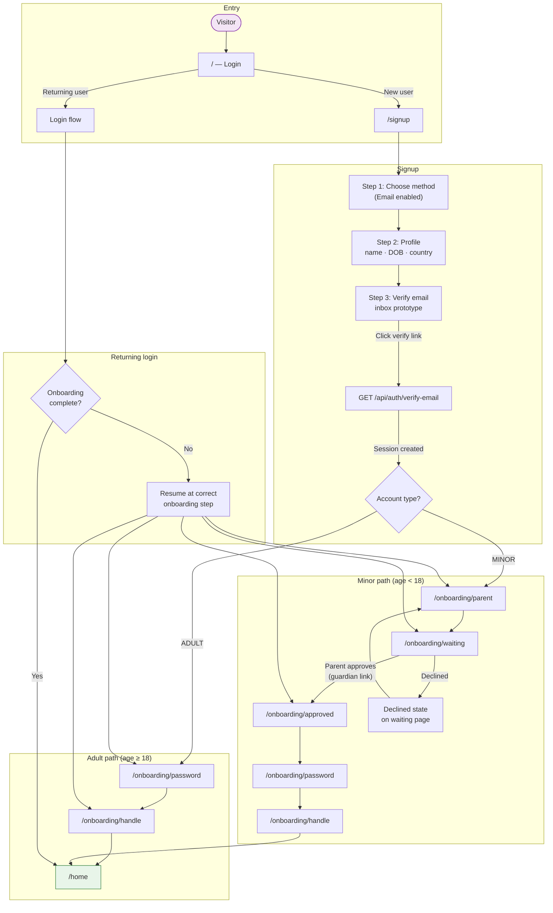

# Overview — InrCliq Web Prototype User Flow

High-level journey from first visit to home. Prototype helpers (consent, controls, simulated inboxes) are omitted here; see [05-prototype-tools.md](./05-prototype-tools.md).

## Redirect logic

After login or email verification, the app uses `getOnboardingRedirect()` to send the user to the right screen based on:

- `onboardingStep` on the user record
- Whether email is verified
- For minors: parent invite status (`PENDING`, `APPROVED`, `DECLINED`)

Complete onboarding always ends at **`/home`**.
