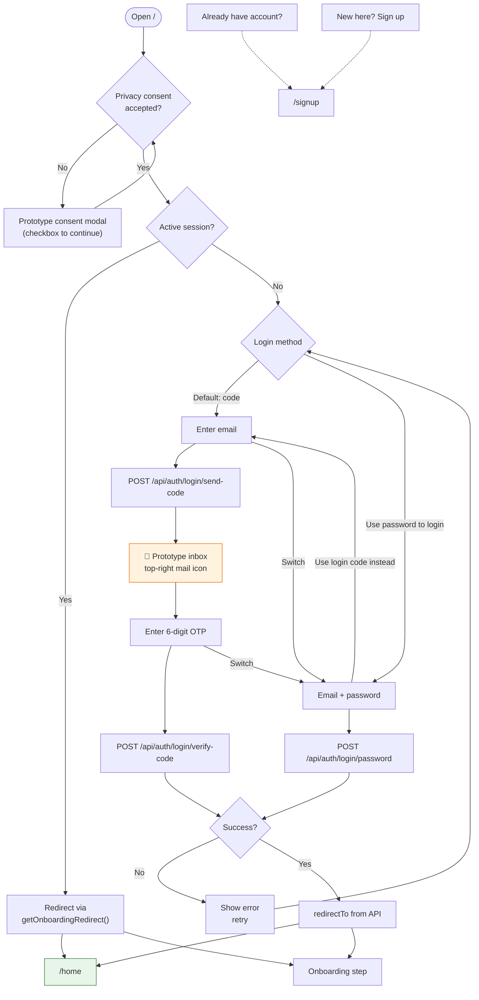

# Login Flow — `/`

Authenticated users hitting `/` are redirected immediately to their current onboarding step or `/home`.

## Prototype inbox (login code)

| Step | Behaviour |
| --- | --- |
| Send code | API returns `loginCode`; stored in `sessionStorage` |
| Mail icon | Opens popover with copyable 6-digit code |
| Resend | Cooldown timer (30s default) |

## Resume destinations after login

| Condition | Route |
| --- | --- |
| Onboarding complete | `/home` |
| Email not verified | `/signup` (step 3 state via sessionStorage) |
| Minor, no invite sent | `/onboarding/parent` |
| Minor, invite pending | `/onboarding/waiting` |
| Minor, invite approved | `/onboarding/approved` |
| Minor, invite declined | `/onboarding/waiting` (declined UI) |
| Needs password | `/onboarding/password` |
| Needs handle | `/onboarding/handle` |
