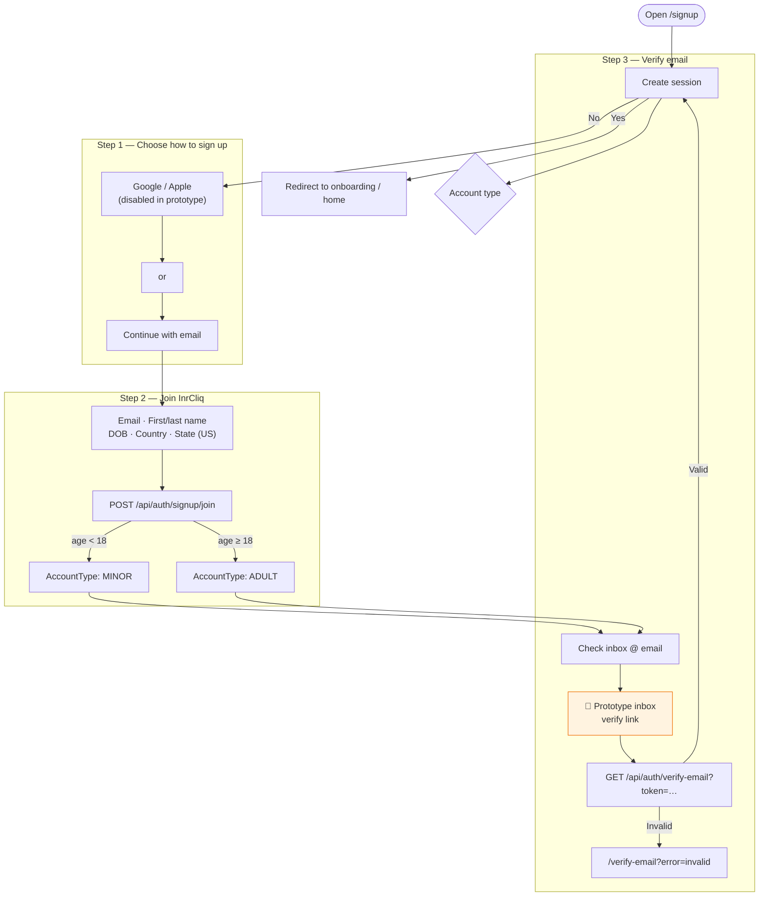
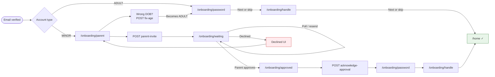

# Signup & Onboarding

## Signup — `/signup`

## Post-verification onboarding

## Screen details

### `/onboarding/password`

- Create password (8+ chars, letters + numbers) **or** skip
- Skip → passwordless login via email code only
- Next → `/onboarding/handle`

### `/onboarding/handle`

- Suggested `@handle` from name
- Validate and save **or** skip
- Next → `/home` (onboarding complete)

### `/onboarding/parent` (minor only)

- Enter parent/guardian email
- Sends approval email (logged to console; inbox on waiting page)
- Option: **Wrong date of birth** → converts account to adult → `/onboarding/password`

### `/onboarding/waiting` (minor only)

- Shows pending status; polls every 10s
- Resend parent email (cooldown)
- Prototype inbox with approval link (opens `/guardian/approve` in new tab)
- On `APPROVED` → auto-navigate to `/onboarding/approved`
- On `DECLINED` → show decline message; link back to parent step

### `/onboarding/approved` (minor only)

- Celebration screen
- **Continue** → `/onboarding/password`
