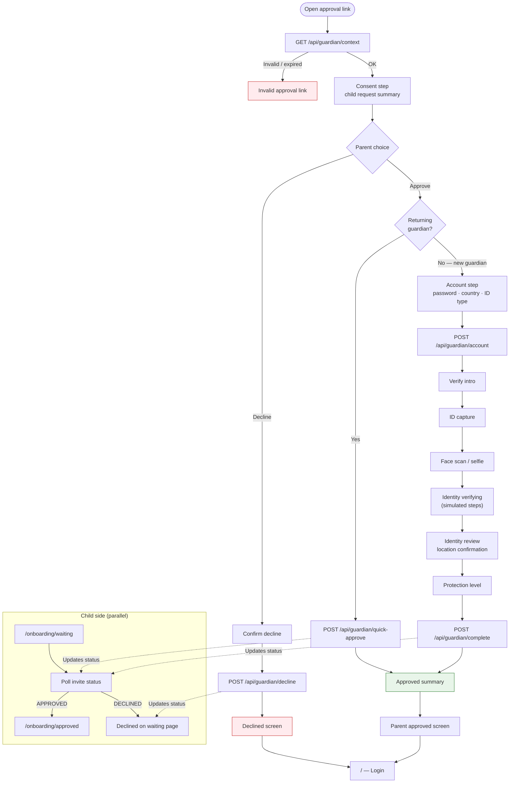

# Guardian / Parent Approval — `/guardian/approve?token=…`

Separate journey for the parent or guardian. Reached via the approval link in the prototype parent inbox (or server logs). Runs outside the child’s onboarding screens but updates the child’s invite status.

## Guardian stepper (new guardian path)

| Step | Label | Screens |
| --- | --- | --- |
| 1 | Account | Consent → Account details |
| 2 | Verify | Intro → ID capture → Face scan → Verifying |
| 3 | Review | Confirm identity & child location |
| 4 | Protection | Choose protection tier |
| 5 | Approved | Success summary |

## Returning guardian

If the parent email already belongs to a completed guardian account, **Approve** on the consent step skips identity verification and completes approval in one API call.
