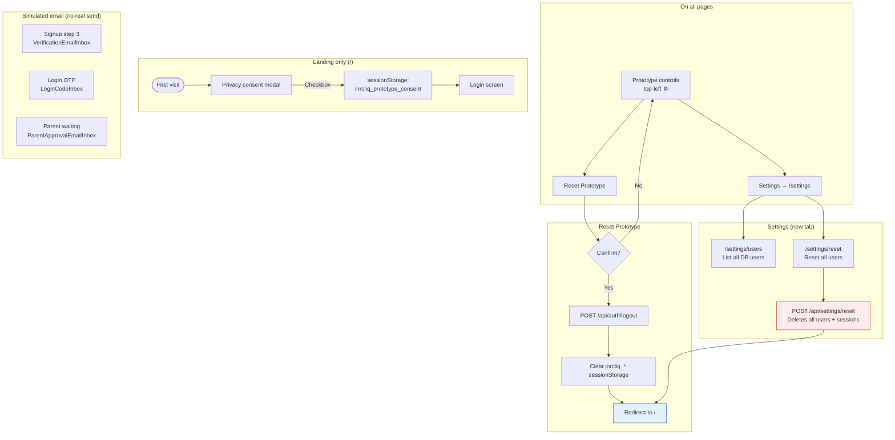

# Prototype Tools & Admin

Helpers used during usability testing. Not part of the production user journey but present on prototype screens.

## Reset Prototype vs Reset all users

| Action | Scope | Database |
| --- | --- | --- |
| **Reset Prototype** | Current browser session + sessionStorage | Unchanged |
| **Reset all users** (Settings) | All users and sessions | Full wipe |

## Session storage keys (cleared by Reset Prototype)

| Key | Used for |
| --- | --- |
| `inrcliq_prototype_consent` | Privacy modal dismissed |
| `inrcliq_signup_email` | Resume signup step 3 |
| `inrcliq_signup_verify_url` | Verification inbox link |
| `inrcliq_login_code` | Login OTP inbox |
| `inrcliq_login_code_email` | Login OTP email |
| `inrcliq_parent_approve_url` | Parent approval inbox link |

## Email simulation

Emails are **not sent** in the prototype. The API logs links to the server console, and the UI exposes them via top-right inbox popovers.
